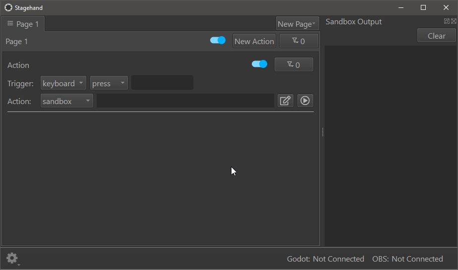
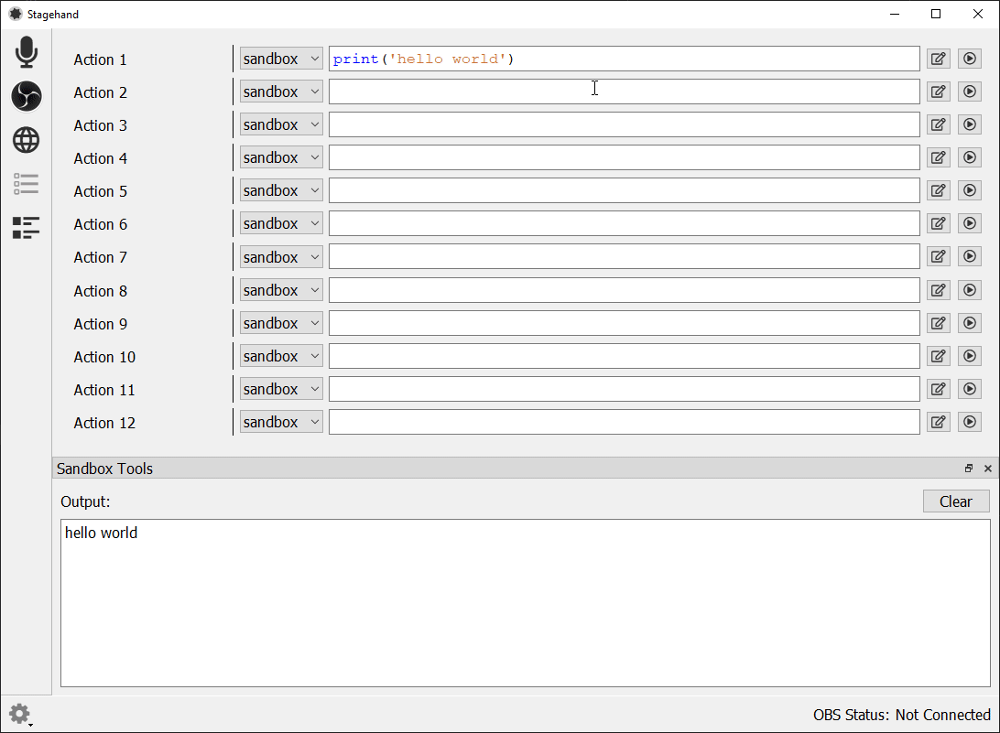
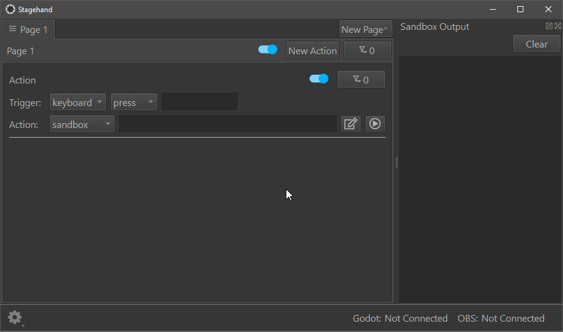
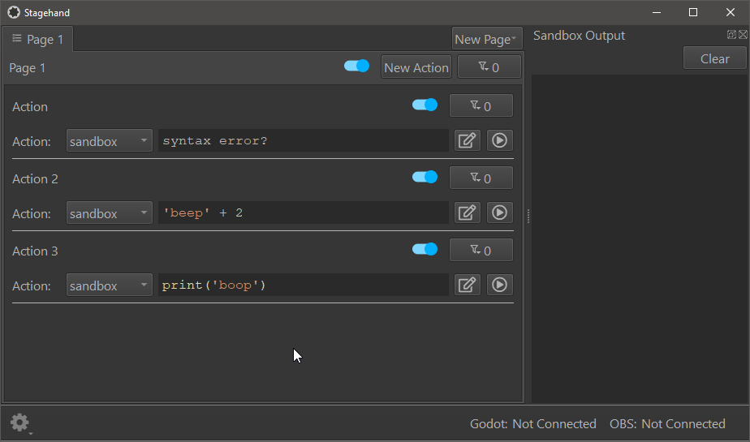
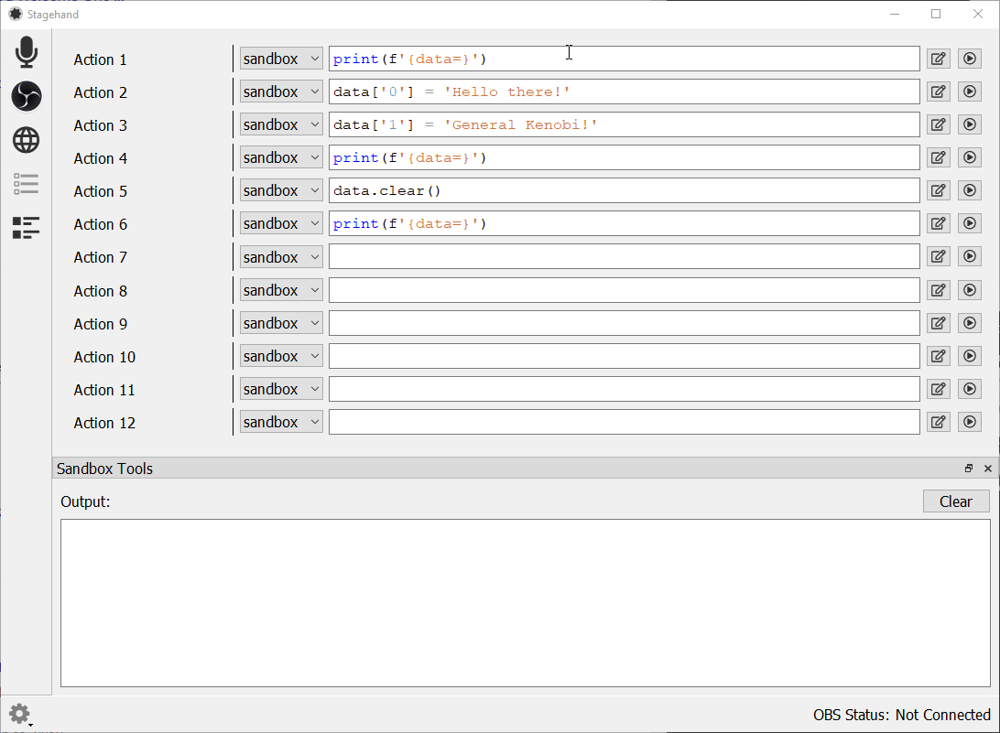
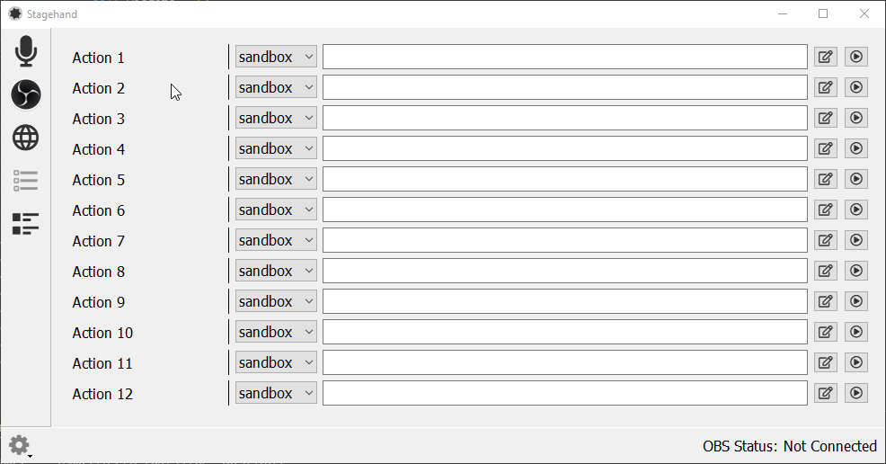
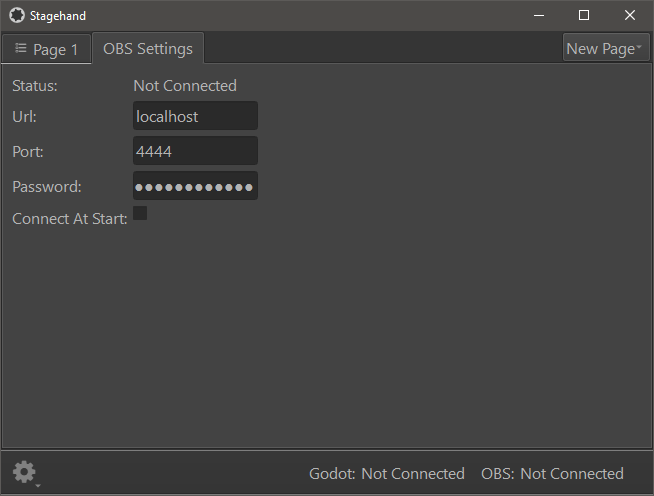
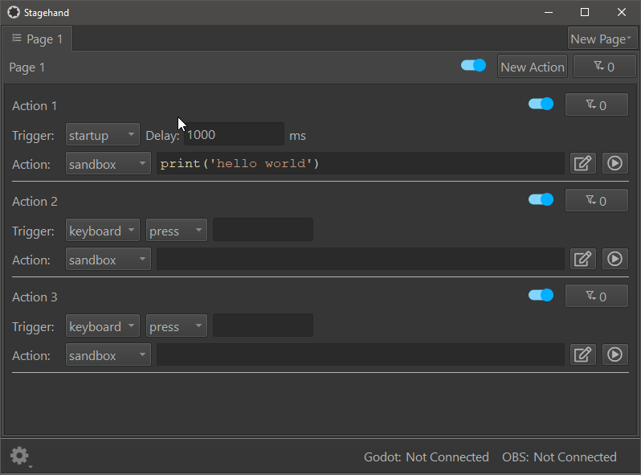
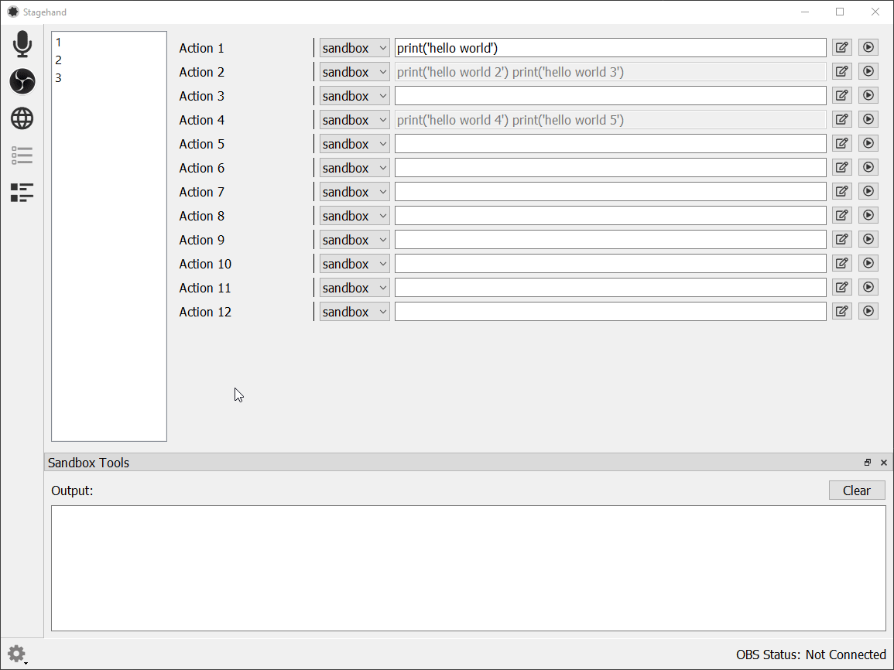
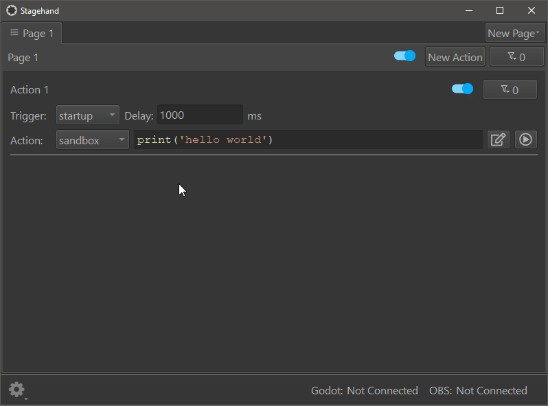

# Stagehand

Stagehand is a collection of tools that help automate and streamline your OBS experience.

# Installation

Stagehand is developed primarily on Windows 10, and has been lightly tested on Ubuntu 20.04. In theory, there's no reason it won't also work on MacOS, but I don't currently have plans to support Macs. 

## Latest development build:

- [windows-installer](https://nightly.link/DaelonSuzuka/Stagehand/workflows/release.yaml/master/windows-installer.zip)
- [windows-portable](https://nightly.link/DaelonSuzuka/Stagehand/workflows/release.yaml/master/windows-portable.zip)
- [linux-portable](https://nightly.link/DaelonSuzuka/Stagehand/workflows/release.yaml/master/linux-portable.zip)

Stagehand is also perfectly happy to execute from source. This requires git, Python 3, and GNU Make to be installed(Ubuntu systems also need the `python3-venv` package, for some reason). Simply clone the repo and run it as follows:

```bash
git clone git@github.com:DaelonSuzuka/Stagehand.git
cd Stagehand
make run
```

Ubuntu 20.04 (and presumably other distros) don't have portaudio installed by default. The python audio library I use(`sounddevice`) includes a copy of portaudio on Windows, but on Linux (and Mac), you'll have to install portaudio using your package manager.

# Action System

The core idea of Stagehand is `actions`. An action has 3 parts: `trigger`, `filter`, and `output`. A `trigger` is some external event that causes an action to activate. `Filters` can prevent an action from activating based on some condition. `Output` is what the action actually does.

Stagehand itself only has one `trigger`, one `filter`, and one `output`. All additional functionality is provided by a robust plugin system.

# Sandbox Plugins

Plugins can register one or more `triggers`, `filters`, or `outputs`, which are made available for use both in Stagehand's UI and in the `Sandbox`'s execution environment.

Stagehand comes standard with a number of plugins:
- OBS remote control
- Microphone Voter
- Web Actions
- Joystick
- Keyboard
- Physical Input Device Support, including
  - Stomp4 pedals
  - Stomp5 pedals
  - Click4 switches


## OBS Websocket Connection

Stagehand connects to OBS Studio using Palakis' excellent [obs-websocket](https://github.com/Palakis/obs-websocket) plugin.

By default, Stagehand looks for an obs-websocket server at `localhost:4444`. It's no problem if OBS is running on a different computer or you defined a custom port for the obs-websocket server, just update the fields in the OBS Manager tab.

Stagehand also supports password authentication for obs-websocket.

Stagehand will attempt to connect to the websocket at startup. This behavior can be disabled by unchecking the 'Connect on Startup' box. 

## Microphone Voter

It's possible that I'm the only person with this problem, but my streaming/video call setup has 3 microphones. There's a desk mic on an arm for when I'm sitting at my pc, there's a second desk mic on an arm for when I'm at my electronics workbench, and there's a mic on my wireless headset. If I don't mute the 2 I'm not actively using, then my outbound audio gets a nasty echo from two/three mics picking up the same sounds. I try to keep the inactive mics muted, but I often forget to change the mute settings when moving back and forth between my computer and workbench.

Stagehand's Microphone Voter solves this by monitoring my microphone audio, calculating which mic is currently the loudest, and sending commands to OBS to mute/unmute the proper mics. 

I can even use this in discord/zoom/whatever calls by using OBS to route my audio devices to the input of a VoiceMeeter Virtual Audio Cable, and using the output of that Virtual Audio Cable as my 'microphone' in discord.

# Roadmap

- Documentation
- Examples and usage

# Sandbox Action Examples

Don't let the limited number of built-in actions fool you, they're actually *extremely* powerful.

Pretty much the simplest action in any language is to print 'hello world', so let's start with that.


Actions aren't limited to only one line, simply press the edit button to pop out the multiline editor.


Actions can do a lot more than just print. The sandbox is a full python execution environment.


The sandbox is an isolated environment, and code is checked for errors before being executed. Typos and syntax errors aren't going to crash Stagehand.


Stagehand has more tools available than just running code snippets directly. Data persistence allows you to write complex actions that just aren't possible on other platforms.


# Plugin Examples

The `keyboard` plugin provides a `trigger` that listens for key presses and an `output` that can simulate keypresses in your system.


## OBS Manager


# Workflow
## Copy/Paste


## Reset actions with one click


## Rename actions with a double click

