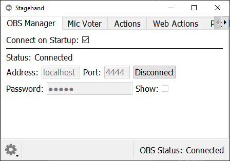

# Stagehand

Stagehand is a collection of tools that help automate and streamline your OBS experience.

# Features

## OBS Websocket Connection

Stagehand connects to OBS Studio using Palakis' excellent [obs-websocket](https://github.com/Palakis/obs-websocket) plugin.

By default, Stagehand looks for an obs-websocket server at `localhost:4444`. It's no problem if OBS is running on a different computer or you defined a custom port for the obs-websocket server, just update the fields in the OBS Manager tab.

Stagehand also supports password authentication for obs-websocket.

Stagehand will attempt to connect to the websocket at startup. This behavior can be disabled by unchecking the 'Connect on Startup' box. 

## Action Sandbox

Stagehand sends commands to OBS via the [obs-websocket protocol](https://github.com/Palakis/obs-websocket/blob/4.x-current/docs/generated/protocol.md). 

Currently only a few actions are implemented, but complete support is a planned feature.

## Microphone Voter

It's possible that I'm the only person with this problem, but my streaming/video call setup has 3 microphones. There's a desk mic on an arm for when I'm sitting at my pc, there's a second desk mic on an arm for when I'm at my electronics workbench, and there's a mic on my wireless headset. If I don't mute the 2 I'm not actively using, then my outbound audio gets a nasty echo from two/three mics picking up the same sounds. I try to keep the inactive mics muted, but I often forget to change the mute settings when moving back and forth between my computer and workbench.

Stagehand's Microphone Voter solves this by monitoring my microphone audio, calculating which mic is currently the loudest, and sending commands to OBS to mute/unmute the proper mics. 

I can even use this in discord/zoom/whatever calls by using OBS to route my audio devices to the input of a VoiceMeeter Virtual Audio Cable, and using the output of that Virtual Audio Cable as my 'microphone' in discord.

# Installation

Stagehand is developed primarily on Windows 10, and has been lightly tested on Ubuntu 20.04. In theory, there's no reason it won't also work on MacOS, but I don't currently have plans to support Macs. 

Binary releases are coming soon. Stagehand is also perfectly happy to execute from source. This requires git, Python 3, and GNU Make to be installed. Simply clone the repo and run it as follows:

```bash
git clone git@github.com:DaelonSuzuka/Stagehand.git
cd Stagehand
make run
```

Ubuntu 20.04 (and presumably other distros) don't have portaudio installed by default. The python audio library I use(`sounddevice`) includes a copy of portaudio on Windows, but on Linux (and Mac), you'll have to install portaudio using your package manager.

# Roadmap

- Multiple 

# Contributing

todo


# Feature Gallery

## OBS Manager


## Microphone Voter


## Action Editing