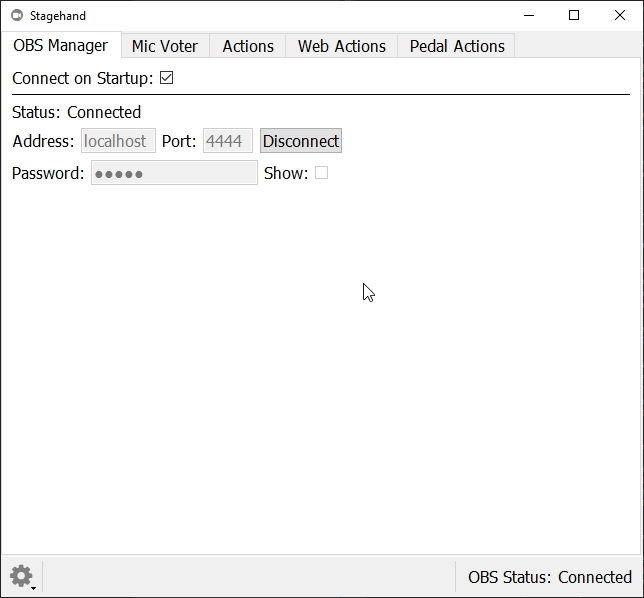
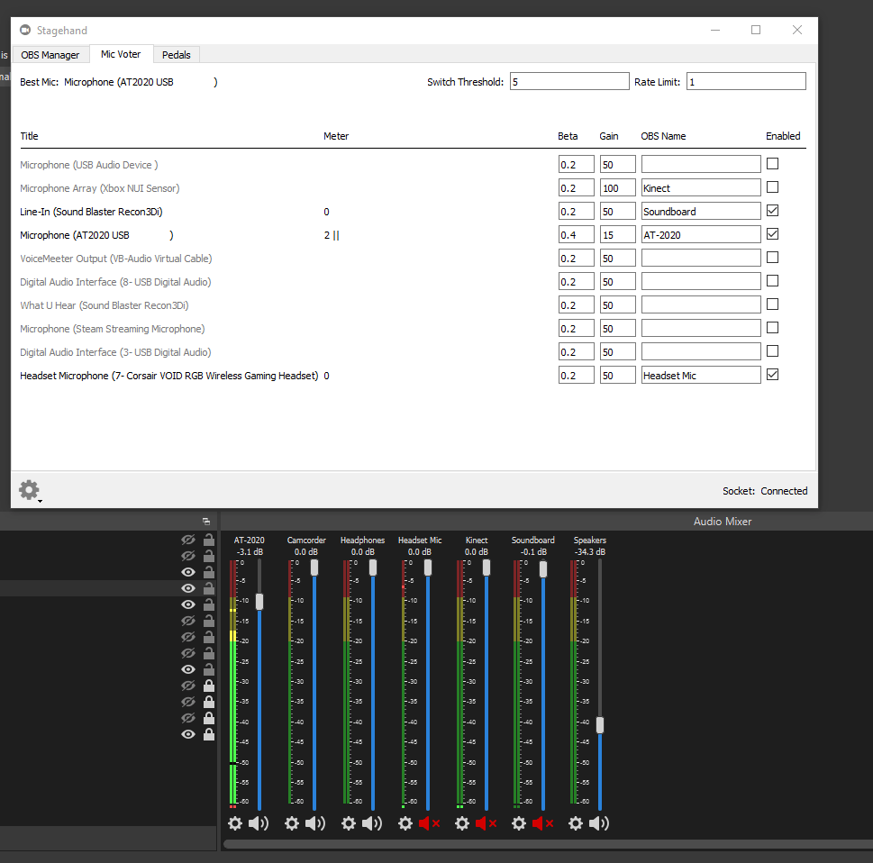

# Stagehand

Stagehand is a collection of tools that help automate and streamline your OBS experience.

# Features

## OBS Websocket


## Microphone Voter



## Sandbox Engine

# Installation

Stagehand is developed primarily on Windows 10, and has been lightly tested on Ubuntu 20.04. In theory, there's no reason it won't also work on MacOS, but I don't currently have plans to support Macs. 

Binary releases are coming soon. Stagehand is also perfectly happy to execute from source. Simply clone the repo and run it as follows:

```bash
git clone git@github.com:DaelonSuzuka/Stagehand.git
cd Stagehand
make run
```

Ubuntu 20.04 (and presumably other distros) don't have portaudio installed by default. The python audio library I use(`sounddevice`) includes a copy of portaudio on Windows, but on Linux (and Mac), you'll have to install portaudio using your package manager.

# Roadmap

- Multiple 

# Contributing

todo