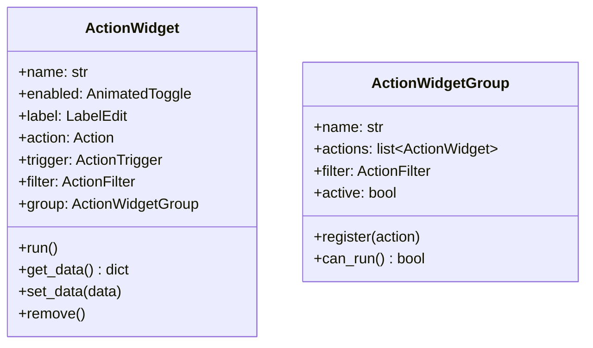

# ActionWidget and ActionWidgetGroup

## ActionWidget

**File**: `src/stagehand/actions/action_widget.py`

Primary UI component for a single action. Contains name label, enable toggle, trigger, filter, and output widgets.



## Layout

```
┌────────────────────────────────────────────────────────────┐
│ [LabelEdit_______________] [Enabled Toggle] [Filter Btn] │
│ [Trigger Widget___________________________________]       │
│ [Action Widget_________________________] [Run Button]     │
│ ───────────────────────────────────────────────────────── │
└────────────────────────────────────────────────────────────┘
```

## ActionWidgetGroup

Manages a collection of actions with group-level filtering:

- **Purpose**: Allows enabling/disabling all actions in a page at once
- **Filtering**: Group-level filters checked before action-level filters
- **Registration**: Actions call `group.register(self)` on init

```python
class ActionWidgetGroup:
    def can_run(self) -> bool:
        if not self.active:
            return False
        if not self.filter.check_filters():
            return False
        return True
    
    def register(self, action):
        self.actions.append(action)
        action.changed.connect(self.on_action_change)
        action.action.this = self.this
```

## Data Serialization

```python
default_data = {
    'name': 'Action',
    'enabled': True,
    'action': {'type': 'sandbox', 'action': ''},
    'trigger': {'enabled': True, 'trigger_type': 'keyboard', 'trigger': ''},
    'filter': {'enabled': True, 'filters': []},
}
```

## Draggable Behavior

ActionWidget is decorated with `@draggable`:
- Drag to reorder within same page
- Drag to different page tab
- Data serialized via `get_drag_data()`
- Drop target calls `accept_action_drop()`

## Drag & Drop Data

```python
def get_drag_data(self) -> QMimeData:
    mime = QMimeData()
    data = json.dumps(self.get_data()).encode()
    mime.setData('action_drop', data)
    return mime
```

## CompactActionWidget

Variant with simplified layout (no trigger/filter widgets displayed):

```python
class CompactActionWidget(ActionWidget):
    def do_layout(self):
        # Horizontal: Label | VLine | Action | Run Button
```