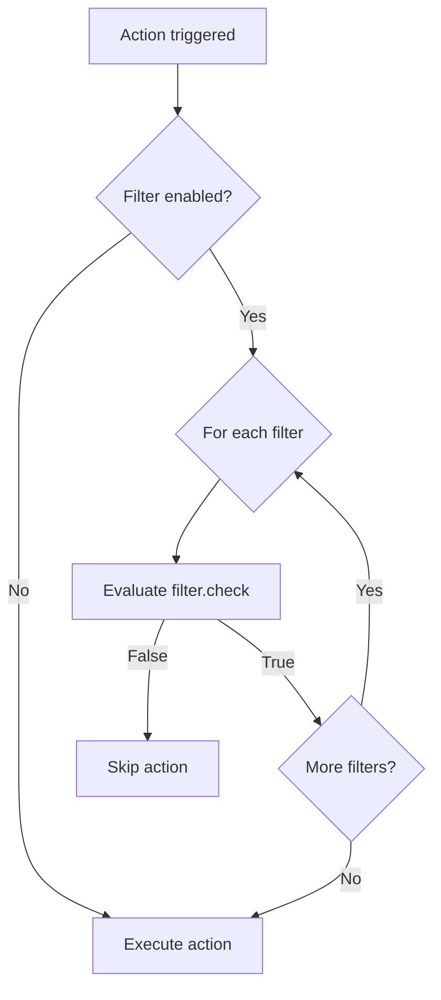
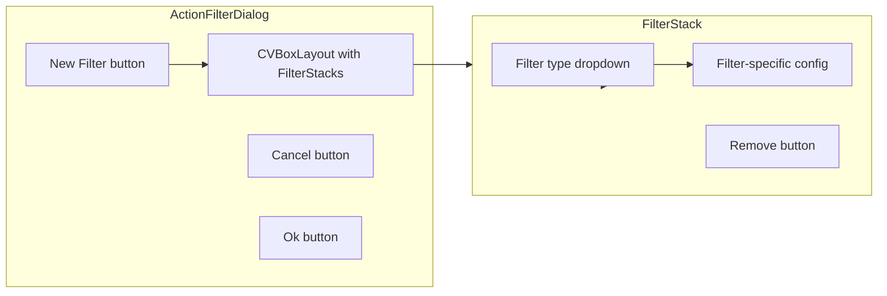

# Filters

## Overview

Filters are conditional checks that must pass for an action to execute. Multiple filters can be stacked per action (AND logic).

**File**: `src/stagehand/actions/action_filter.py`

## Base Class: FilterStackItem

```python
class FilterStackItem(QWidget):
    @abstractmethod
    def check(self) -> bool:
        """Return True to allow action, False to block."""
        ...
    
    @abstractmethod
    def set_data(self, data: dict): ...
    
    @abstractmethod
    def get_data(self) -> dict: ...
```

## FilterStack Widget

Individual filter in the filter stack:

```python
class FilterStack(QWidget):
    changed = Signal()
    
    def __init__(self):
        self.type = QComboBox()  # Filter type selector
        self.stack = QStackedWidget()  # Filter config widgets
        self.remove = QPushButton('X')  # Delete button
        self.pls_delete = False  # Deletion flag
        
    def check(self):
        return self.stack.currentWidget().check()
    
    def on_remove(self):
        self.pls_delete = True
        self.setVisible(False)
```

## ActionFilter Widget

Container managing filter stack and editor dialog:

```python
class ActionFilter(QWidget):
    def __init__(self):
        self.filters: list[FilterStack] = []
        self.editor = ActionFilterDialog(self.filters)
        self.open_btn = QPushButton('0')  # Shows filter count
        
    def check_filters(self) -> bool:
        if not self.enabled.isChecked():
            return True  # Filters disabled -> pass
        return all([f.check() for f in self.filters])
```

## Filter Evaluation Logic



## Built-in Filters

| Filter | Name | Purpose |
|--------|------|---------|
| SandboxFilter | 'sandbox' | Eval Python expression |

### SandboxFilter Implementation

```python
class SandboxFilterWidget(FilterStackItem):
    name = 'sandbox'
    
    def __init__(self, changed):
        self.filter = QLineEdit()
        self.filter.textChanged.connect(changed)
    
    def check(self) -> bool:
        """Evaluate filter expression in sandbox."""
        return Sandbox().eval(self.filter.text())
    
    def set_data(self, data: dict):
        self.filter.setText(data.get('filter', ''))
    
    def get_data(self) -> dict:
        return {'filter': self.filter.text()}
```

## Filter Editor Dialog



## Data Structure

```json
{
  "filter": {
    "enabled": true,
    "filters": [
      {"filter_type": "sandbox", "filter": "data['mode'] == 'streaming'"},
      {"filter_type": "sandbox", "filter": "load('streaming') == True"}
    ]
  }
}
```

## Common Filter Patterns

```python
# Check sandbox data
filter: "data['stream_title'] == 'Gaming'"

# Check loaded value
filter: "load('current_mode') == 'debug'"

# Complex logic
filter: "data['level'] > 5 and load('boss_active') == False"

# Check OBS state (via extension)
filter: "obs.is_streaming()"
```