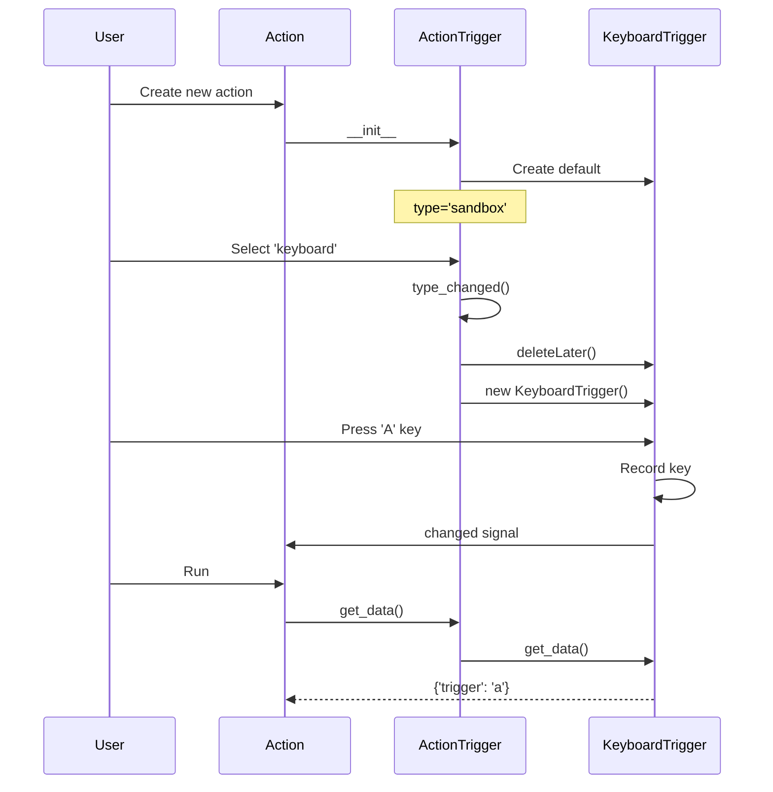

# Triggers

## Overview

Triggers define event sources that activate actions. Each action has one trigger.

**File**: `src/stagehand/actions/action_trigger.py`

## Base Class: TriggerItem

```python
class TriggerItem(QWidget):
    @classmethod
    def get_subclasses(cls):
        return {c.name: c for c in cls.__subclasses__()}
    
    @classmethod
    def get_item(cls, name):
        return cls.get_subclasses()[name]
    
    @abstractmethod
    def set_data(self, data: dict): ...
    @abstractmethod
    def get_data(self) -> dict: ...
    def reset(self): pass
```

## Registration

Triggers register via class attribute:

```python
class KeyboardTrigger(TriggerItem):
    name = 'keyboard'  # Appears in dropdown
```

Discovery via `TriggerItem.__subclasses__()`.

## ActionTrigger Widget

Container that manages trigger type selection:

```python
class ActionTrigger(QWidget):
    def __init__(self, changed, run, trigger_type='sandbox'):
        self.type = QComboBox()  # Trigger type dropdown
        self.trigger = SandboxTrigger(changed, run)
        
        for trigger in TriggerItem.__subclasses__():
            self.type.addItem(trigger.name)
        
        self.type.currentIndexChanged.connect(self.type_changed)
    
    def type_changed(self):
        # Destroy old trigger widget
        # Create new trigger widget of selected type
        trigger_class = TriggerItem.get_item(self.type.currentText())
        self.trigger = trigger_class(self._changed, self._run)
```

## Built-in Triggers

| Trigger | Name | Plugin | Purpose |
|---------|------|--------|---------|
| SandboxTrigger | 'sandbox' | built-in | Manual activation (run button) |
| KeyboardTrigger | 'keyboard' | keyboard | Key press detection |
| JoystickTrigger | 'joystick' | joystick | Game controller input |
| StartupTrigger | 'startup' | built-in | Run on application start |
| DeviceTrigger | 'device' | devices | Physical hardware input |
| Stomp4Trigger | 'stomp4' | devices/stomp4 | 4-pedal controller |
| Stomp5Trigger | 'stomp5' | devices/stomp5 | 5-pedal controller |
| Click4Trigger | 'click4' | devices/click4 | 4-switch controller |

## Trigger Lifecycle



## KeyboardTrigger Example

```python
class KeyboardTrigger(TriggerItem):
    name = 'keyboard'
    
    def __init__(self, changed, run):
        super().__init__()
        self.input = KeySeqEdit()
        self.input.keySequenceChanged.connect(changed)
        
    def get_data(self) -> dict:
        return {'trigger': self.input.keySequence().toString()}
    
    def set_data(self, data: dict):
        self.input.setKeySequence(QKeySequence(data.get('trigger', '')))
    
    def run(self):
        # Triggered by keyboard input listener
        pass
```