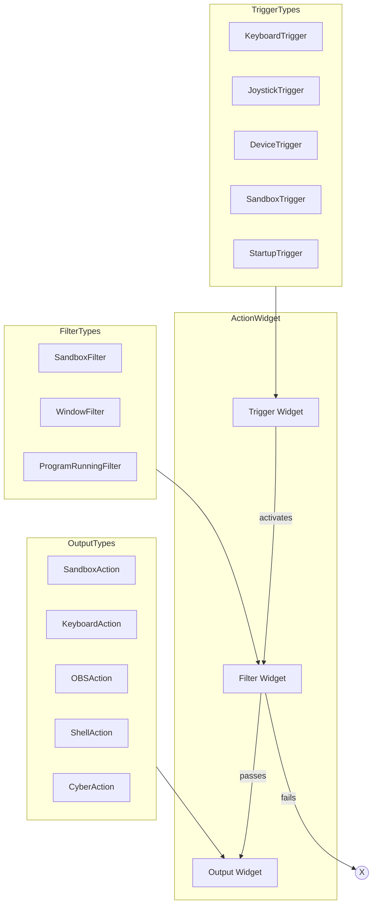
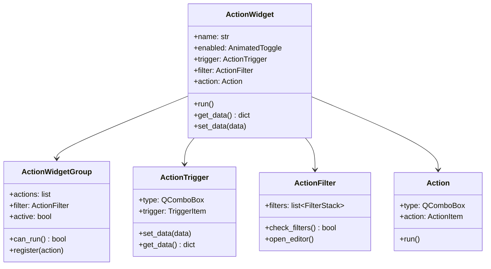
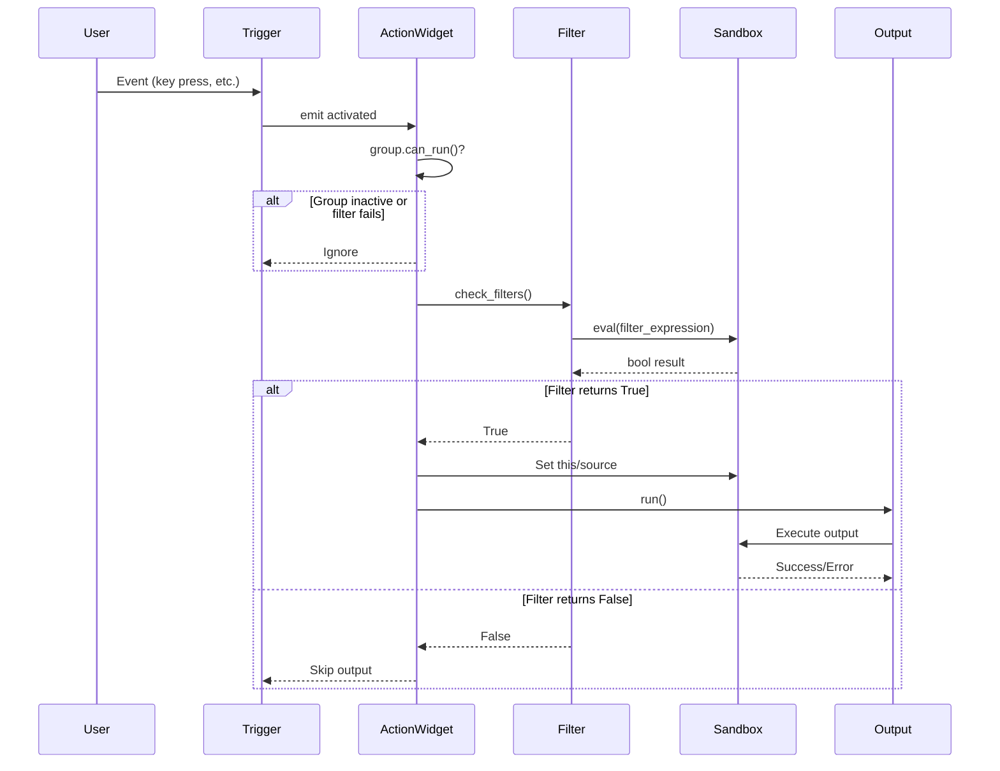

# Actions System

## Overview

Actions are the core user-configurable unit. Each Action combines:
- **Trigger**: Event source (keyboard, device, etc.)
- **Filter**: Optional conditions (AND-logic)
- **Output**: Operation to perform



## Data Model

```json
{
  "name": "My Action",
  "enabled": true,
  "trigger": {
    "enabled": true,
    "trigger_type": "keyboard",
    "trigger": "ctrl+shift+a"
  },
  "filter": {
    "enabled": true,
    "filters": [
      {"filter_type": "sandbox", "filter": "data['mode'] == 'streaming'"}
    ]
  },
  "action": {
    "type": "sandbox",
    "action": "print('Hello!')"
  }
}
```

## Class Hierarchy



## Execution Flow



## Registration Pattern

All trigger/action/filter types register via class inheritance:

```python
# Trigger registration
class MyTrigger(TriggerItem):
    name = 'my_trigger'  # Shown in trigger dropdown
    # Must implement: set_data(), get_data()

# Action registration  
class MyAction(ActionItem):
    name = 'my_action'  # Shown in action dropdown
    # Must implement: set_data(), get_data(), run()

# Filter registration
class MyFilter(FilterStackItem):
    name = 'my_filter'  # Shown in filter dropdown
    # Must implement: set_data(), get_data(), check()
```

Discovery happens via `__subclasses__()` on base classes.