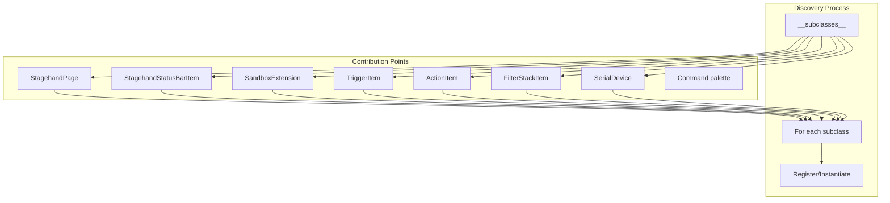

# Contribution Points

Stagehand provides multiple extension points where plugins can contribute UI elements, behaviors, and functionality. The application controls where things are displayed; plugins provide the implementation.

## Overview

All contribution points use Python's `__subclasses__()` discovery mechanism. When the application needs to populate UI elements, it queries all subclasses of base classes and instantiates/registers them.



## 1. StagehandPage - Tab Pages

**Location**: Tab widget in main window

**Discovery**: `StagehandPage.__subclasses__()`

**Registration**: Define `page_type` class attribute

**Tags**:
- `'user'` - Appears in "New Page" menu
- `'singleton'` - Only one instance allowed (use `SingletonPageMixin`)

```python
from stagehand.components import StagehandPage, SingletonPageMixin

# User-createable page (multiple instances)
class MyPage(StagehandPage):
    page_type = 'My Feature'
    tags = ['user']
    
    def __init__(self, name='', changed=None, data=None):
        super().__init__()
        self.name = name
        self.icon_name = 'mdi.icon-name'
        # Build UI here
        
    def get_name(self) -> str:
        return self.name
        
    def get_data(self) -> dict:
        return {'page_type': self.page_type, ...}
        
    def set_data(self, data: dict):
        # Restore state from saved data
        pass

# Singleton page (settings pages)
class MySettingsPage(SingletonPageMixin, StagehandPage):
    page_type = 'My Settings'
    # tags automatically includes 'singleton'
```

**Examples**:
| Page | Type | Tags | Plugin |
|------|------|------|--------|
| ActionsPage | 'Generic Actions' | ['user'] | core |
| ObsSettingsPage | 'OBS Settings' | ['singleton', 'user'] | obs_core |
| MicVoterPage | 'Microphone Voter' | ['user'] | microphone_voter |
| NodeGraphPage | 'Node Graph' | ['user'] | nodegraph |
| RadialMenuPage | 'Radial Menu' | ['user'] | radial_menu |

**Integration Point**:
```python
# In MainTabWidget.__init__():
for c in StagehandPage.__subclasses__():
    if 'user' in c.tags:
        more_pages_button.addAction(c.page_type)
```

## 2. StagehandStatusBarItem - Status Bar Widgets

**Location**: Main window status bar (right side)

**Discovery**: `StagehandStatusBarItem.__subclasses__()`

**Registration**: Subclass `StagehandStatusBarItem`

```python
from stagehand.components import StagehandStatusBarItem

class MyStatusWidget(StagehandStatusBarItem):
    def __init__(self, parent=None):
        super().__init__(parent)
        
        self.status_label = QLabel('Status: OK')
        
        with CHBoxLayout(self, margins=0) as layout:
            layout.add(QLabel('MyPlugin:'))
            layout.add(self.status_label)
```

**Examples**:
| Widget | Purpose | Plugin |
|--------|---------|--------|
| ObsStatusWidget | OBS connection status, connect/disconnect | obs_core |
| GodotStatusWidget | Godot connection status | godot |

**Integration Point**:
```python
# In MainWindow.init_statusbar_items():
for widget in StagehandStatusBarItem.__subclasses__():
    self.statusbar.addWidget(widget(self.statusbar))
```

## 3. SandboxExtension - Sandbox Namespace Injection

**Location**: Available in sandbox Python scripts

**Discovery**: `SandboxExtension.__subclasses__()`

**Registration**: Define `name` class attribute (string or list of strings for aliases)

```python
from stagehand.sandbox import SandboxExtension

class MyExtension(SandboxExtension):
    name = 'my_plugin'  # Available as: my_plugin.method()
    # Or: name = ['my_plugin', 'mp']  # Both names work
    
    def do_something(self, arg):
        """Available in sandbox as: my_plugin.do_something(arg)"""
        return f"Did something with {arg}"
    
    @property
    def status(self):
        """Available as: my_plugin.status"""
        return 'active'
```

**Namespace Access**:
```python
# In sandbox scripts:
my_plugin.do_something('hello')  # Returns: "Did something with hello"
print(my_plugin.status)          # Prints: "active"
```

**Examples**:
| Extension | Name(s) | Methods | Plugin |
|-----------|---------|---------|--------|
| KeyboardExtension | 'keyboard' | press(), release(), type() | keyboard |
| MouseExtension | 'mouse' | move(), click(), scroll() | keyboard |
| ObsExtension | 'obs' | set_current_scene(), set_source_visibility(), etc. | obs_core |
| ShellExtension | ['bash', 'sh'] | eval() | shell |
| CmdExtension | 'cmd' | eval() | shell |
| PowershellExtension | ['powershell', 'ps'] | eval() | shell |
| GodotExtension | 'godot' | call(), send() | godot |
| HttpExtension | 'http' | (HTTP utilities) | generic |
| SocketsExtension | 'sockets' | (Socket utilities) | generic |

**Integration Point**:
```python
# In Sandbox.__init__():
for ext in SandboxExtension.__subclasses__():
    e = ext()
    if isinstance(ext.name, list):
        for name in ext.name:
            self.extensions[name] = e
    else:
        self.extensions[ext.name] = e
```

## 4. TriggerItem - Action Triggers

**Location**: Action trigger dropdown in ActionWidget

**Discovery**: `TriggerItem.__subclasses__()`

**Registration**: Define `name` class attribute

```python
from stagehand.actions.items import TriggerItem

class MyTrigger(TriggerItem):
    name = 'my_trigger'  # Appears in trigger dropdown
    
    def __init__(self, changed, run):
        super().__init__()
        self._changed = changed  # Signal connection for dirty tracking
        self._run = run           # Callback when trigger fires
        self.input = QLineEdit()
        self.input.textChanged.connect(changed)
        
    def get_data(self) -> dict:
        return {'trigger': self.input.text()}
        
    def set_data(self, data: dict):
        self.input.setText(data.get('trigger', ''))
        
    def reset(self):
        self.input.clear()
```

**Examples**:
| Trigger | Name | Description | Plugin |
|---------|------|-------------|--------|
| SandboxTrigger | 'sandbox' | Manual trigger (run button) | core |
| KeyboardTrigger | 'keyboard' | Key press detection | keyboard |
| JoystickTrigger | 'joystick' | Game controller input | joystick |
| StartupTrigger | 'startup' | Run on app start | core |

## 5. ActionItem - Action Outputs

**Location**: Action type dropdown in ActionWidget

**Discovery**: `ActionItem.__subclasses__()`

**Registration**: Define `name` class attribute, implement `run()`

```python
from stagehand.actions.items import ActionItem

class MyAction(ActionItem):
    name = 'my_action'  # Appears in action dropdown
    
    def __init__(self, changed, owner=None):
        super().__init__()
        self.owner = owner
        self._changed = changed
        
        self.config = QLineEdit()
        self.config.textChanged.connect(changed)
        
    def get_data(self) -> dict:
        return {'config': self.config.text()}
        
    def set_data(self, data: dict):
        self.config.setText(data.get('config', ''))
        
    def run(self):
        """Executed when action is triggered."""
        # Do something
        pass
```

**Examples**:
| Action | Name | Description | Plugin |
|--------|------|-------------|--------|
| SandboxAction | 'sandbox' | Execute Python code | core |
| KeyboardAction | 'keyboard' | Simulate keypresses | keyboard |
| ShellAction | 'shell' | Run shell commands | shell |
| CyberAction | 'cyber' | Run Cyberlang scripts | cyber |

## 6. FilterStackItem - Action Filters

**Location**: Filter stack in ActionFilter dialog

**Discovery**: `FilterStackItem.__subclasses__()`

**Registration**: Define `name` class attribute, implement `check()`

```python
from stagehand.actions.items import FilterStackItem

class MyFilter(FilterStackItem):
    name = 'my_filter'  # Appears in filter dropdown
    
    def __init__(self, changed):
        super().__init__()
        self.condition = QLineEdit()
        self.condition.textChanged.connect(changed)
        
    def check(self) -> bool:
        """Return True to allow action, False to block."""
        # Evaluate condition
        return True
        
    def get_data(self) -> dict:
        return {'condition': self.condition.text()}
        
    def set_data(self, data: dict):
        self.condition.setText(data.get('condition', ''))
```

**Examples**:
| Filter | Name | Description | Plugin |
|--------|------|-------------|--------|
| SandboxFilterWidget | 'sandbox' | Evaluate Python expression | core |
| WindowFilter | 'window' | Check active window | window_filter |

## 7. SerialDevice - Device Profiles

**Location**: DeviceManager auto-discovery

**Discovery**: `SerialDevice.__subclasses__()`

**Registration**: Define `profile_name` class attribute

```python
from codex import SerialDevice

class MyDevice(SerialDevice):
    profile_name = 'my_device'
    
    def __init__(self, device=None, port=None, baud=115200):
        super().__init__(device=device, port=port, baud=baud)
        # Device-specific initialization
        
    def communicate(self):
        """Called periodically to process serial data."""
        pass
```

**Examples**:
| Device | profile_name | Description | Plugin |
|--------|-------------|-------------|--------|
| Stomp4Profile | 'stomp4' | 4-pedal controller | devices/stomp4 |
| Stomp5Profile | 'stomp5' | 5-pedal controller | devices/stomp5 |
| Click4Profile | 'click4' | 4-switch controller | devices/click4 |
| RockerProfile | 'rocker' | Rocker pedal | devices/rocker |

**Integration Point**:
```python
# In DeviceManager profiles():
@staticmethod
def profiles():
    return {p.profile_name: p for p in SerialDevice.__subclasses__()}
```

## 8. Command - Command Palette Items

**Location**: Global command palette (Ctrl+Shift+P)

**Registration**: Add to `self.commands` list in widgets

```python
from qtstrap.extras.command_palette import Command

class MyWidget(QWidget):
    def __init__(self):
        super().__init__()
        
        self.commands = [
            Command('MyPlugin: Do Something', triggered=self.do_something),
            Command('MyPlugin: Configure', triggered=self.open_config),
        ]
```

**Command Palette Discovery**:
Commands are collected from:
- `MainWindow.commands`
- `ObsStatusWidget.commands`
- `GodotStatusWidget.commands`
- Other status widgets with `commands` attribute

**Examples**:
| Command | Location | Action |
|---------|----------|--------|
| 'OBS: Connect websocket' | ObsStatusWidget | Connect to OBS |
| 'Godot: Open Settings' | GodotStatusWidget | Open settings page |
| 'Theme: Set to Dark Mode' | MainWindow | Switch theme |

## 9. StagehandDockWidget - Dock Widgets

**Location**: Dockable panels (hidden/show via Settings menu)

**Discovery**: Base class exists, no automatic discovery

**Registration**: Subclass `StagehandDockWidget`

```python
from stagehand.components import StagehandDockWidget

class MyDockWidget(StagehandDockWidget):
    def __init__(self, parent=None):
        super().__init__('My Panel', parent)  # Title
        # Build contents
```

**Note**: Currently manual integration in MainWindow. Standard pattern:
```python
# In MainWindow.__init__():
self.my_dock = MyDockWidget(self)
self.settings_menu.addAction(self.my_dock.toggleViewAction())
```

## Summary Table

| Contribution Point | Base Class | Discovery Method | Location |
|-------------------|------------|-----------------|----------|
| Tab Pages | `StagehandPage` | `__subclasses__()` | MainTabWidget |
| Status Bar Items | `StagehandStatusBarItem` | `__subclasses__()` | MainWindow |
| Sandbox Extensions | `SandboxExtension` | `__subclasses__()` | Sandbox namespace |
| Triggers | `TriggerItem` | `__subclasses__()` | ActionWidget dropdown |
| Actions | `ActionItem` | `__subclasses__()` | ActionWidget dropdown |
| Filters | `FilterStackItem` | `__subclasses__()` | Filter dialog |
| Devices | `SerialDevice` | `__subclasses__()` | DeviceManager |
| Commands | `Command` | Manual registration | Command palette |
| Dock Widgets | `StagehandDockWidget` | Manual | MainWindow docks |

## Registration Pattern

All automatic discovery follows this pattern:

```python
# In the consuming class:
for cls in BaseClass.__subclasses__():
    instance = cls(constructor_args)
    # Register or display instance
```

This enables:
- **Loose coupling**: Plugins don't import application code
- **Hot-pluggable**: Adding new plugins doesn't require code changes
- **Consistent UI**: Application controls placement and styling