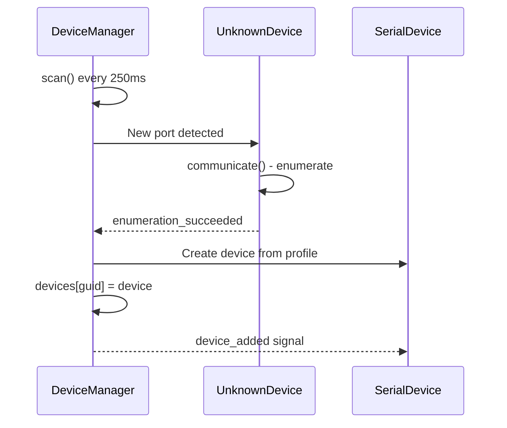
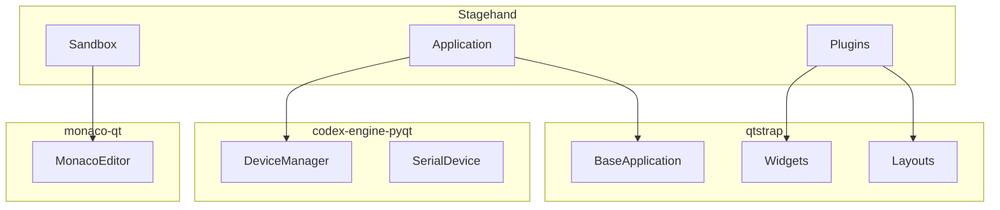

# External Dependencies

Stagehand has three tightly integrated workspace dependencies managed via `uv` workspace. These are custom framework packages developed alongside Stagehand.

## Workspace Configuration

```toml
# pyproject.toml
[tool.uv.sources]
qtstrap = { workspace = true }
codex-engine-pyqt = { workspace = true }
monaco-qt = { workspace = true }

[tool.uv.workspace]
members = [
    "../qtstrap",
    "../codex-engine-pyqt",
    "../monaco-qt",
]
```

## qtstrap (v0.7.1)

"The Bootstrap of Qt" - Custom Qt framework providing:

### Core Components

| Component | Purpose |
|-----------|---------|
| `BaseApplication` | Application singleton with theme management, portable settings |
| `BaseMainWindow` | Main window with tray support, settings persistence |
| `OPTIONS` | Global app configuration container |
| `QSettings` | Portable settings when `.portable` flag exists |

### Layout Helpers

- `CVBoxLayout`, `CHBoxLayout` - Context managers for layouts
- `CGridLayout`, `CFormLayout` - Context-managed grid/form layouts
- `CSplitter`, `PersistentCSplitter` - Splitters with state persistence
- `CScrollArea` - Scroll area with context manager

### Widgets

- `LabelEdit` - Editable label widget
- `AnimatedToggle`, `PersistentAnimatedToggle` - Toggle switches
- `PersistentCheckBox`, `PersistentComboBox` - Auto-saving widgets
- `BaseDockWidget`, `BaseToolbar` - Dock/toolbar helpers
- `VLine`, `HLine` - Separator lines
- `MenuButton`, `StateButton` - Custom button types

### Theme System

```python
App().change_theme('light')  # or 'dark'
# Theme persisted in QSettings
# Icons cached via qtawesome
```

### CommandPalette Theming

The `CommandPalette` widget uses QPalette colors dynamically for proper dark/light mode support:

```python
# PopupDelegate.get_colors() adapts colors based on theme
palette = QApplication.palette()

self.normal = QPen(palette.color(QPalette.WindowText))  # Normal text
self.selected = QPen(QColor('#FFFFFF'))                  # White for selected items
self.highlight = QPen(QColor('#00d4ff'))               # Cyan for search matches

# Selection background - desaturated to let cyan matches stand out
if palette.color(QPalette.Window).lightness() < 128:
    self.background = QColor('#3d4f5f')  # Muted blue-gray for dark theme
else:
    self.background = QColor('#b0c4d1')  # Muted blue-gray for light theme
```

**Why custom selection background:**
- Cyan match highlights (`#00d4ff`) need contrast against selection background
- Standard `Highlight` color is too saturated blue, competing with cyan
- Muted blue-gray (`#3d4f5f` / `#b0c4d1`) lets cyan matches pop visually

**Color choices:**
- `WindowText` → Normal text color (adapts to theme)
- White selected text → Maximum contrast on muted background
- Cyan highlight → Stands out against desaturated selection

### Key Pattern: `@singleton`

```python
from qtstrap import singleton

@singleton
class MyClass:
    pass
```

### Key Pattern: Context Layouts

```python
with CVBoxLayout(self) as layout:
    layout.add(QLabel('Hello'))
    with layout.hbox():  # Nested horizontal
        layout.add(btn1)
        layout.add(btn2)
```

### Key Pattern: Portable Mode

```python
# Create file at app root: .portable
# OPTIONS.portable = True
# Settings saved to ./settings.ini instead of user config dir
```

## codex-engine-pyqt (v0.3.1)

"A universal translator for serial devices" - Hardware device management:

### Core Components

| Component | Purpose |
|-----------|---------|
| `DeviceManager` | Auto-discovers and manages serial devices |
| `SerialDevice` | Base class for device profiles |
| `DeviceControlsWidget` | Standard device control UI |
| `SubscriptionManager` | Event subscription system |

### Device Discovery Flow



### Device Profile Pattern

```python
# In Stagehand plugins:
class Stomp5Profile(SerialDevice):
    profile_name = 'stomp5'
    
    def __init__(self, port, baud=115200, device=None):
        super().__init__(port, baud, device)
        # Custom initialization
```

### Device Subscription

```python
# Subscribe to device events
App().device_manager.subscribe(device.guid, callback)
App().device_manager.subscribe_to('profile_name', callback)
```

### Stagehand Integration

- Pedals: Stomp4, Stomp5, Rocker profiles
- Switches: Click4 profile
- All managed in `Application.__init__`:
  ```python
  self.device_manager = DeviceManager(self)
  ```

## monaco-qt (v0.2.0)

"The Monaco editor as a Qt Widget" - Code editor integration:

### Features

- Microsoft Monaco editor embedded in Qt
- Syntax highlighting
- Code completion framework
- Used in `SandboxActionEditor` for Python code editing

### Structure

```
monaco-qt/
  monaco/
    __init__.py
    ... (widget implementation)
```

### Usage in Stagehand

Used by sandbox action editor for code editing with syntax highlighting.

## Dependency Relationships



## Usage Patterns

### Creating a Stagehand Widget

```python
from qtstrap import *

class MyWidget(QWidget):
    def __init__(self):
        super().__init__()
        with CVBoxLayout(self) as layout:
            layout.add(QLabel('Hello'))
            with layout.hbox():
                layout.add(PersistentPushButton('Click'))
```

### Creating a Device Profile

```python
from codex import SerialDevice

class MyDevice(SerialDevice):
    profile_name = 'my_device'
    
    def __init__(self, device=None, port=None, baud=115200):
        super().__init__(device=device, port=port, baud=baud)
        # Profile-specific setup
```

### Accessing Application Singletons

```python
from qtstrap import App

App().device_manager  # DeviceManager instance
App().change_theme('dark')  # Theme switching
```