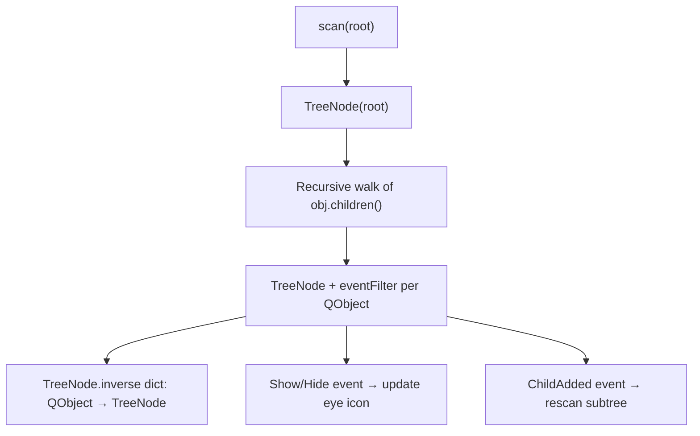
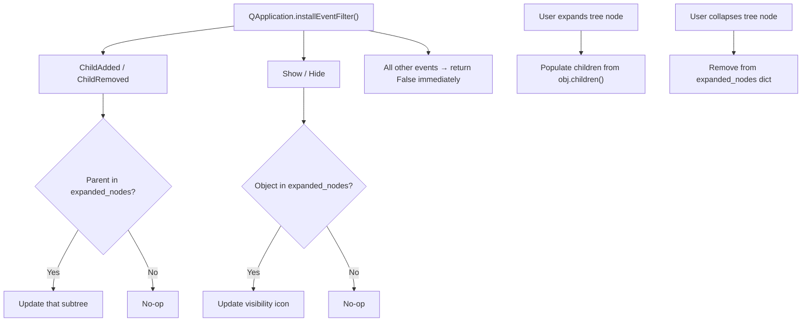

# Devtools Architecture

Qt live devtools for inspecting and modifying the running application. Housed in `qtstrap/src/qtstrap/extras/devtools/`, currently **disabled** in Stagehand (imports and menu entries commented out in `MainWindow`).

## Components

| Module | Status | Purpose |
|--------|--------|---------|
| `scene_tree.py` | Partial | Live QObject hierarchy viewer with visibility toggles |
| `inspector.py` | Minimal | Shows objectName, type, nearest Qt base class for selected widget |
| `style_editor.py` | Working but flawed | Monaco-based CSS editor for live stylesheet editing |
| `repl.py` | Stub | Placeholder — only renders a label "REPL" |

## Scene Tree — Current Architecture



**Problems with current approach:**

1. **Full upfront scan** — `scan()` recursively walks every QObject, creating TreeNodes for all of them
2. **Event filter on every QObject** — every show/hide/child event across the entire app passes through Python
3. **`TreeNode.inverse` dict grows forever** — `obj_destroyed` handler is commented out, so destroyed QObjects leak in the dict
4. **`call_later(scan, 2000ms)`** — fragile timing assumption for when UI is ready
5. **Context menu actions** ("Open REPL", "Edit Style") are not wired to anything

## Planned Architecture — Lazy + Firehose

Replace per-object event filters with a single `QApplication`-level event filter and lazy tree population.



**Key design:**

- **`QApplication.installEventFilter()`** — single filter on the app instance receives every event for every object. Filter fast by `event.type()`: only care about `ChildAdded`, `ChildRemoved`, `Show`, `Hide`. All other events hit `return False` in nanoseconds.
- **Lazy population** — root starts expanded, everything else populates on expand via `obj.children()`. No upfront scan.
- **`expanded_nodes` dict** — maps `QObject` → `TreeNode` only for currently-expanded branches. When a node collapses, remove from dict. Structural events only update nodes in this dict.
- **Zero cost when hidden** — install/remove the application event filter when the Scene Tree dock is shown/hidden.

```python
class SceneTreeWatcher(QObject):
    """Receives all events via QApplication.installEventFilter(). 
    Only processes structural and visibility events for expanded subtrees."""
    
    def __init__(self, expanded_nodes: dict):
        super().__init__()
        self.expanded_nodes = expanded_nodes  # {QObject: TreeNode}
    
    def eventFilter(self, obj, event):
        type_ = event.type()
        if type_ == QEvent.ChildAdded or type_ == QEvent.ChildRemoved:
            if obj in self.expanded_nodes:
                self.expanded_nodes[obj].update_children()
        elif type_ == QEvent.Show or type_ == QEvent.Hide:
            if obj in self.expanded_nodes:
                self.expanded_nodes[obj].update_visibility_icon()
        return False
```

**Why this is better:**

| Concern | Current | Planned |
|---------|---------|---------|
| Startup cost | Full recursive scan + filter install | Populate root only |
| Per-event overhead | Every event on every QObject hits Python | Only structural/visibility events, and only for expanded nodes |
| Memory | TreeNode + eventFilter per QObject, global inverse dict | Dict entries only for expanded nodes |
| Cleanup | Commented-out destroyed handler, leaks | Dict entries removed on collapse |
| Staleness | scan() clears and rebuilds from scratch | Targeted updates only |

## Style Editor — Current Issue

**Bug:** `self.parent().setStyleSheet(text)` applies stylesheet to `MainWindow`, overwriting any existing stylesheet on that widget.

**Fix:** Apply custom styles to `QApplication.instance().setStyleSheet(text)` instead. Since the app uses `QPalette` + `QStyle` for theming (not `setStyleSheet`), there's nothing on `QApplication` to overwrite. The palette and stylesheet coexist — palette handles named color roles, stylesheet handles everything else.

If a base stylesheet is ever added to `QApplication`, store it via `QApplication.setProperty('base_stylesheet', text)` and layer: `app.setStyleSheet(base_stylesheet + '\n' + custom_stylesheet)`.

## Integration in Stagehand

All three dock widgets are commented out in `MainWindow.__init__()` and `init_settings_menu()`:

```python
# from qtstrap.extras.devtools import ReplDockWidget, SceneTreeDockWidget, StyleEditorDockWidget
# self.style_editor = StyleEditorDockWidget(self)
# self.repl = ReplDockWidget(self)
# self.scene_tree = SceneTreeDockWidget(self)
# menu.addAction(self.style_editor.toggleViewAction())
# menu.addAction(self.repl.toggleViewAction())
# menu.addAction(self.scene_tree.toggleViewAction())
```

To re-enable: uncomment imports, instantiations in `__init__`, and menu entries in `init_settings_menu`.

## Related

- [dependencies.md](dependencies.md) — qtstrap package details
- [entry-points.md](entry-points.md) — MainWindow construction order