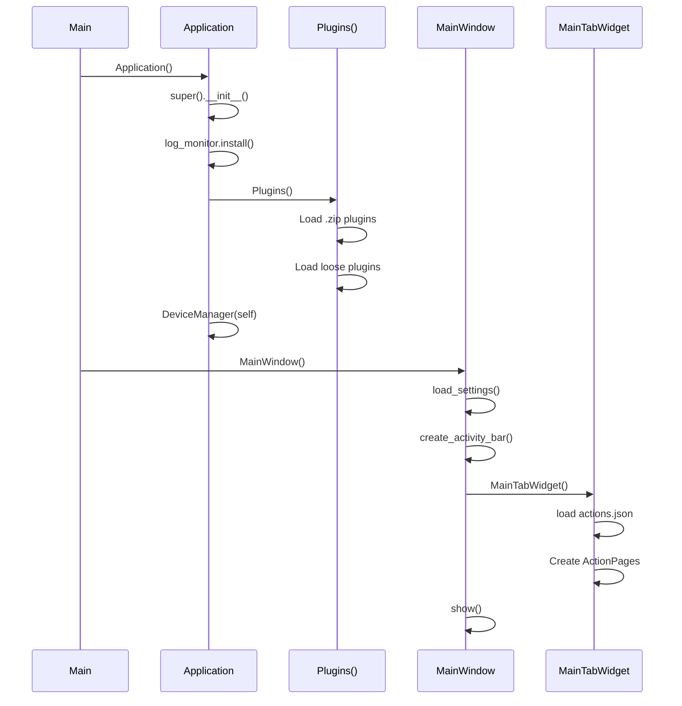

# Entry Points

## Main Entry Point

**File**: `src/stagehand/__main__.py`

```python
def main():
    Application()      # Singleton app, initializes Qt
    MainWindow()       # Main window with tabs, plugins, sandbox
    QtAsyncio.run(handle_sigint=True)  # Event loop
```

## Application Bootstrap Sequence



## Plugin Loading

**File**: `src/stagehand/plugin_loader.py`

Two plugin types:
1. **Zip plugins**: `plugins/<name>.zip` - loaded via `zipimporter`
2. **Loose plugins**: `plugins/<name>/plugin.json` - loaded via `importlib`

Loading sequence:
1. Scan `OPTIONS.BASE_PATH / 'plugins'` directory
2. For each `.zip` file: create zipimporter, load module
3. For each `plugin.json`: add `packages/` to sys.path, import module
4. Store in `Plugins._plugins` dict keyed by module name

## MainWindow Initialization

**File**: `src/stagehand/main_window.py`

Creates:
- `Sandbox()` - singleton sandbox executor
- `DeviceControlsDockWidget` - device management panel
- `LogMonitorDockWidget` - log viewer
- `CommandPalette` - command search
- `MainTabWidget` - tab container for action pages
- System tray icon with minimize-to-tray support

## Settings Loading

**File**: `src/stagehand/tabs.py`

- Location: `OPTIONS.config_dir / 'actions.json'`
- Loaded in `MainTabWidget.load()`
- Each page deserialized via `StagehandPage.set_data()`
- Saved on every change via `changed` signal chain