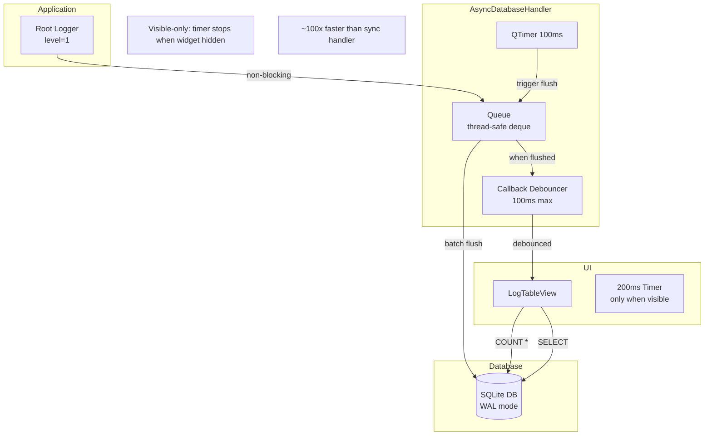

# Logging System

## Overview

Stagehand uses qtstrap's LogMonitor feature for centralized Python logging redirection to a SQLite database. This enables a searchable log viewer dock widget. **The async handler is now the default**, providing non-blocking logging with ~100x better performance than the original synchronous implementation.

## Key Files

| Location | Purpose |
|----------|---------|
| `qtstrap/extras/log_monitor/__init__.py` | `log_monitor.install()` - attaches handler to root logger |
| `qtstrap/extras/log_monitor/async_database_handler.py` | `AsyncDatabaseHandler` - queue-based async logging (default) |
| `qtstrap/extras/log_monitor/log_database_handler.py` | `DatabaseHandler` - legacy sync handler (deprecated) |
| `qtstrap/extras/log_monitor/log_table_view.py` | `LogTableView` - polling with visibility-based refresh |
| `qtstrap/extras/log_monitor/log_widget.py` | `LogMonitorDockWidget` - visibility event handlers |
| `stagehand/application.py:19-20` | Installation point |

## Architecture



## Performance Characteristics

**Benchmark Results** (from `qtstrap/log_monitor_diagnostic.py`):

| Handler | Latency | Relative | Rate |
|---------|---------|----------|------|
| Baseline (no handler) | ~0.007ms | 1x | ~142K/sec |
| DatabaseHandler (sync) | ~2.2ms | **358x slower** | ~450/sec |
| **AsyncDatabaseHandler** | ~0.02ms | 3x slower | ~5,000/sec |

**Async vs Sync improvement: ~102x faster**

## Implementation Details

### AsyncDatabaseHandler (Default)

```python
# log_monitor/__init__.py
def install(database_name=None, install_excepthook=True, use_async=True):
    if use_async:
        logger.addHandler(AsyncDatabaseHandler(database_name))
    else:
        logger.addHandler(DatabaseHandler(database_name))
```

Key features:
- **Queue-based**: Log records queued in thread-safe `deque`
- **Batch INSERTs**: Flush every 100ms with multi-row INSERT
- **Debounced callbacks**: UI notified max 10Hz
- **WAL mode**: `PRAGMA journal_mode=WAL` for concurrent access
- **Visible-only flush**: Stops flushing when log monitor hidden

### Visible-Only Refresh

```python
# log_widget.py
class LogMonitorDockWidget(BaseDockWidget):
    def showEvent(self, event):
        self.log_widget.set_visible_state(True)
    
    def hideEvent(self, event):
        self.log_widget.set_visible_state(False)
```

```python
# log_table_view.py  
class LogTableView:
    def set_visible_state(self, visible: bool):
        if visible:
            self.scan_timer.start(200)  # Resume polling
        else:
            self.scan_timer.stop()       # Stop when hidden
```

**Important**: Visibility only affects UI refresh, not log persistence. Logs are **always** written to the database regardless of whether the log monitor widget is visible.

## Known Issues (Resolved)

| Issue | Status | Resolution |
|-------|--------|------------|
| Root logger captures ALL logs | ✅ Fixed | Async handler is non-blocking |
| Synchronous blocking INSERT | ✅ Fixed | Queue + batch flush |
| Polling COUNT(*) always running | ✅ Fixed | Visible-only refresh |
| Callback on every INSERT | ✅ Fixed | Debounced to 10Hz max |

## Diagnostic Tool

Run the benchmark tool in qtstrap:
```bash
cd P:\_qt\qtstrap
.venv\Scripts\python.exe log_monitor_diagnostic.py
```

## Related

- [entry-points.md](entry-points.md) - Where log_monitor.install() is called
- [dependencies.md](dependencies.md) - qtstrap as workspace dependency