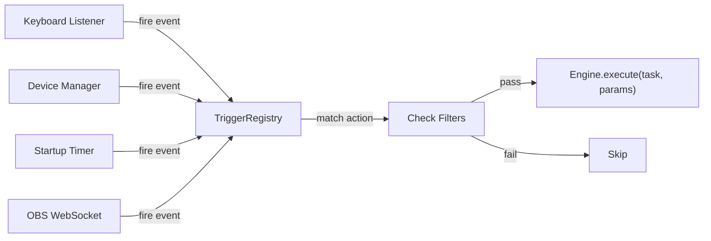
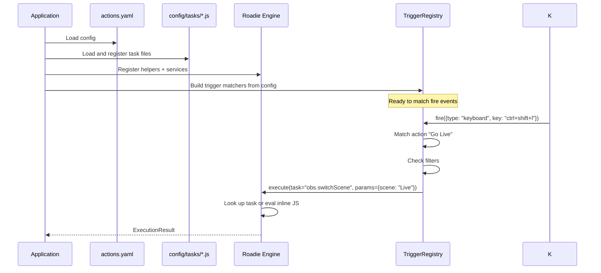
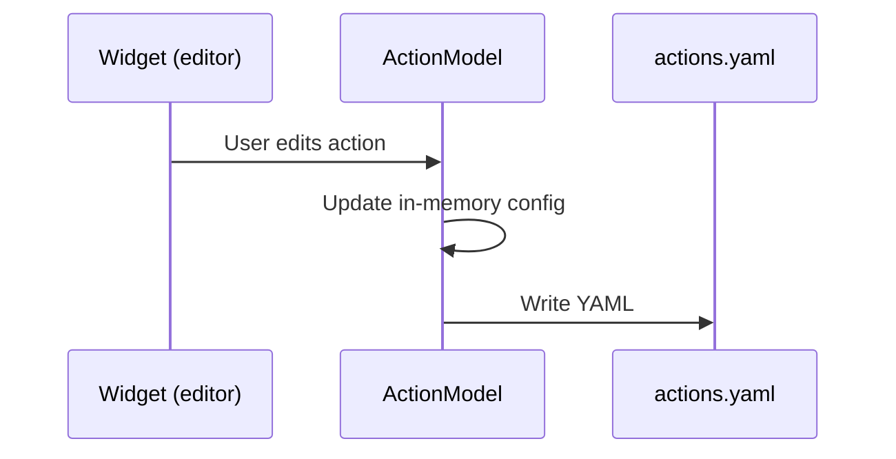

# New Config-Centric Architecture

## Source of Truth

The config files are the source of truth. Widgets are editors for the config, not the routing layer.

```
config/
  actions.yaml          ← trigger wiring (human-editable YAML)
  tasks/                ← JS task library (human-editable)
    obs.js
    streaming.js
    my-tasks.js
  helpers/               ← shared utility functions
    utils.js
```

## Fire Event Architecture

All trigger sources distill down to a `fire` event — a typed dict:

```python
# Keyboard press
{"type": "keyboard", "key": "ctrl+shift+l"}

# Device pedal
{"type": "device", "name": "stomp4", "pedal": 1}

# Startup
{"type": "startup", "delay": 2000}

# OBS event
{"type": "obs", "event": "SceneChanged", "scene": "Live"}
```

The `TriggerRegistry` matches fire events to actions in the config, checks filters, and executes tasks.



## Action Config Format (YAML)

Every trigger, task, and filter follows the `type: {params}` pattern:

```yaml
pages:
  Streaming:
    actions:
      - name: Go Live
        triggers:
          - keyboard: {key: "ctrl+shift+l"}
          - device: {name: "stomp4", pedal: 1}
        task:
          obs.switchScene: {scene: "Live"}
        filters:
          - active_window: "OBS"

      - name: Custom Alert
        triggers:
          - keyboard: {key: "ctrl+shift+a"}
        task:
          stagehand.js: |
            var count = (stagehand.load("count") || 0) + 1
            stagehand.save("count", count)
            stagehand.print("Alert #" + count)
```

## Task Library (JS)

Tasks are named, composable units defined in JS:

```js
// config/tasks/obs.js
stagehand.register({
  id: "obs.switchScene",
  run: (params) => stagehand.obs.switchScene(params.scene),
})
```

Referenced by ID in the config: `task: {obs.switchScene: {scene: "Live"}}`.

## Inline JS Tasks

For one-off actions that don't need a task file:

```yaml
task:
  stagehand.js: |
    stagehand.obs.switchScene("Live")
    stagehand.print("Switched!")
```

Or a short one-liner:

```yaml
task:
  stagehand.js: {body: "stagehand.obs.switchScene('Live')"}
```

## Concern Separation

| Concern | Format | Who manages it |
|---------|--------|---------------|
| **What the system can do** | JS files (task library) | User / community |
| **When to do it** | YAML config (trigger wiring) | GUI or text editor |
| **Utility functions** | JS files (helpers) | User / community |
| **Plugin capabilities** | Python (`stagehand.*` API) | Plugin developers |

## Loading Flow



## Saving Flow



The widget updates the in-memory action model. The model writes to YAML on change.