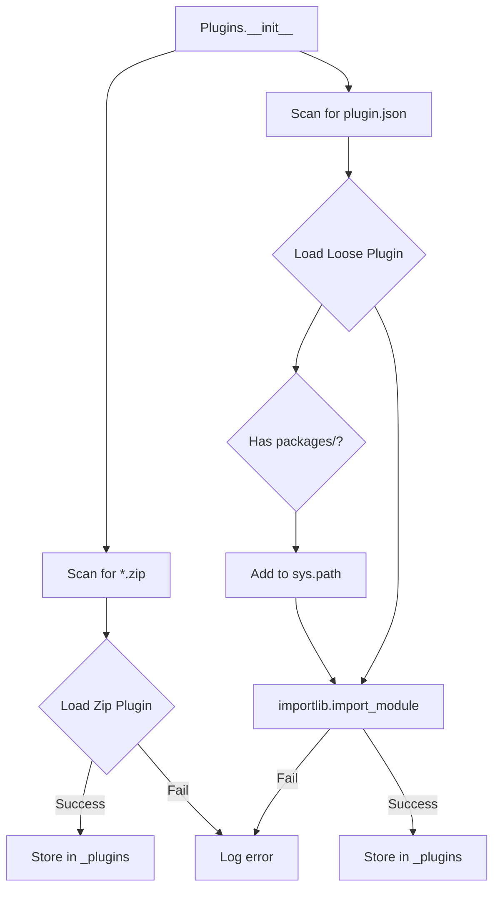

# Plugin Architecture

## Overview

Plugins extend Stagehand with new trigger types, action types, filters, and sandbox extensions. All plugins live in `src/stagehand/plugins/`.

## Plugin Discovery

**File**: `src/stagehand/plugin_loader.py`



## Plugin Structure

### Zip Plugin

```
plugins/
  my_plugin.zip
    ├── __init__.py
    ├── my_trigger.py
    └── my_action.py
```

Loaded via `zipimporter`. Module name derived from filename.

### Loose Plugin

```
plugins/
  my_plugin/
    ├── plugin.json       # Marker file
    ├── __init__.py
    ├── my_trigger.py
    ├── my_action.py
    └── packages/          # Optional: added to sys.path
        └── external_lib/
```

Loaded via `importlib`. Module name: `stagehand.plugins.my_plugin`.

## Built-in Plugins

| Plugin | Purpose | Extensions |
|--------|---------|------------|
| `keyboard` | Keyboard I/O | KeyboardTrigger, KeyboardAction, KeyboardExtension, MouseExtension |
| `joystick` | Game controller | JoystickTrigger, JoystickExtension |
| `devices/stomp4` | 4-pedal controller | Stomp4Trigger |
| `devices/stomp5` | 5-pedal controller | Stomp5Trigger |
| `devices/click4` | 4-switch controller | Click4Trigger |
| `devices/rocker` | Rocker pedal | RockerTrigger |
| `obs_core` | OBS Websocket | OBS actions |
| `microphone_voter` | Auto mic switching | Microphone extension |
| `web_server` | HTTP API | WebServerExtension |
| `shell` | Shell commands | ShellAction |
| `cyber` | Cyberlang scripts | CyberAction |

## Registration Pattern

Plugins register components via class inheritance:

```python
# In my_plugin/__init__.py
from .my_trigger import MyTrigger
from .my_action import MyAction
from .my_extension import MyExtension

# Trigger
class MyTrigger(TriggerItem):
    name = 'my_trigger'

# Action
class MyAction(ActionItem):
    name = 'my_action'

# Extension
class MyExtension(SandboxExtension):
    name = 'my_extension'
```

Discovery via `__subclasses__()` on `TriggerItem`, `ActionItem`, `FilterStackItem`, `SandboxExtension`.

## Extension Points

### UI Registration

Items appear in dropdowns automatically when they subclass the appropriate base:
- `ActionTrigger.type` dropdown shows all `TriggerItem.__subclasses__()`
- `Action.type` dropdown shows all `ActionItem.__subclasses__()`
- `ActionFilter` dialog shows all `FilterStackItem.__subclasses__()`

### Sandbox Injection

```python
class MyExtension(SandboxExtension):
    name = 'my_ext'
    
    def tool(self, arg):
        return arg.upper()

# In sandbox:
# Available as: my_ext.tool('hello')  # Returns 'HELLO'
```

### Singleton Access

```python
# Get plugin module
plugin = Plugins()['plugins.my_plugin']

# Or via attribute
keyboard = Plugins().keyboard
```