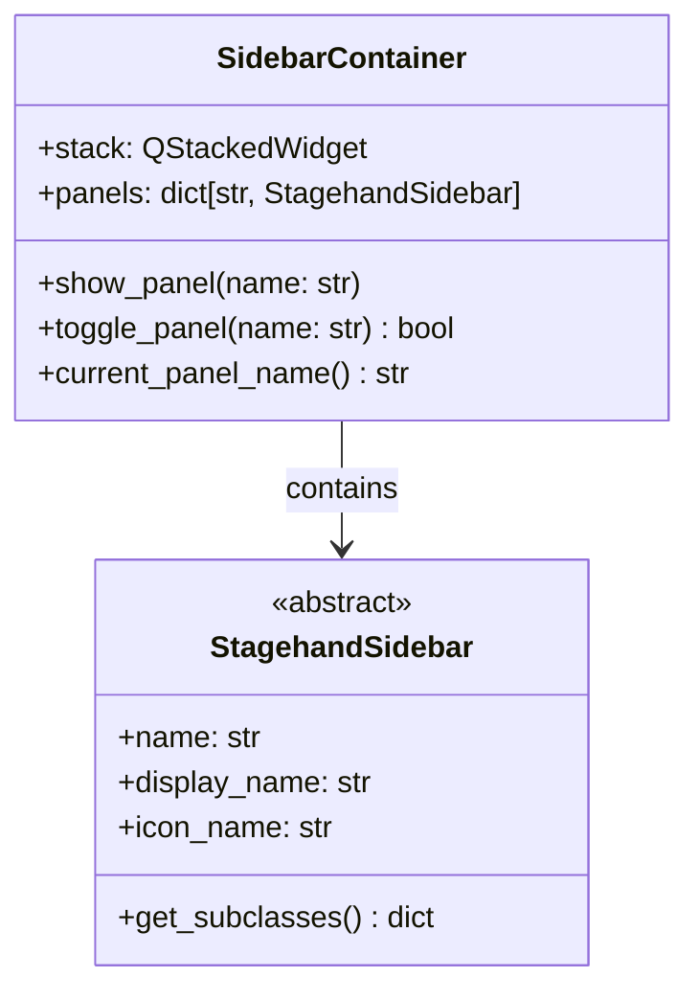
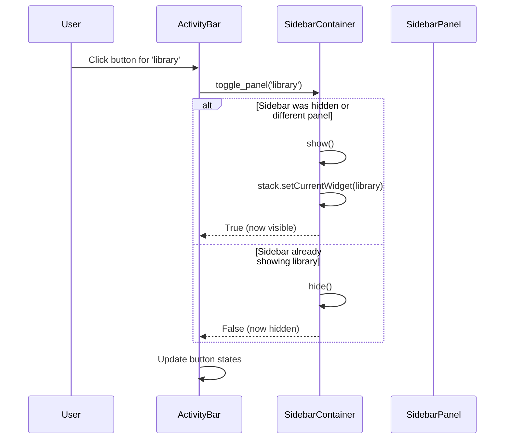

# Sidebar System Architecture

## Overview

Stagehand uses a sidebar system for tool panels (Library, Plugins, etc.) that appears on the left side of the main window. Sidebars are discovered dynamically via `StagehandSidebar.__subclasses__()` and integrated with the activity bar for toggling visibility.

## Components

### StagehandSidebar (Base Class)

**File**: `src/stagehand/components.py`

Base class for all sidebar panels. Plugins can contribute sidebars by subclassing this.

```python
class StagehandSidebar(QWidget):
    """Base class for sidebar panels."""
    name = ''           # Unique identifier (class attr)
    display_name = ''    # Human-readable name (shown in tooltips)
    icon_name = ''       # qtawesome icon name (shown in activity bar)
    
    @classmethod
    def get_subclasses(cls):
        return {c.name: c for c in cls.__subclasses__()}
```

**Contribution Pattern**:
```python
# In a plugin or core module:
from stagehand.components import StagehandSidebar

class LibrarySidebar(StagehandSidebar):
    name = 'library'
    display_name = 'Library'
    icon_name = 'mdi.bookshelf'
    
    def __init__(self, parent=None):
        super().__init__(parent)
        # Build UI...
```

### SidebarContainer

**File**: `src/stagehand/components.py`

Container widget that manages all sidebar panels in a QStackedWidget.



**Discovery**:
```python
# In SidebarContainer.__init__:
for name, cls in StagehandSidebar.get_subclasses().items():
    panel = cls(parent=self)
    self.panels[name] = panel
    self.stack.addWidget(panel)
```

### Activity Bar

**File**: `src/stagehand/main_window.py`

A toolbar on the left side of the window with buttons for each sidebar panel.



## UI Layout

```
┌─────────────────────────────────────────────────────────────────┐
│ MainWindow                                                      │
│ ┌────────┐ ┌─────────────┐ ┌────────────────────────────────────┐│
│ │Activity│ │ Sidebar     │ │ MainTabWidget                      ││
│ │Bar     │ │ Container   │ │                                    ││
│ │        │ │             │ │                                    ││
│ │ ┌────┐ │ │ ┌─────────┐ │ │                                    ││
│ │ │Lib │ │ │ │ Library │ │ │                                    ││
│ │ └────┘ │ │ └─────────┘ │ │                                    ││
│ │ ┌────┐ │ │ (QStacked) │ │                                    ││
│ │ │Plg │ │ │             │ │                                    ││
│ │ └────┘ │ │             │ │                                    ││
│ └────────┘ └─────────────┘ └────────────────────────────────────┘│
└─────────────────────────────────────────────────────────────────┘
```

## Built-in Sidebars

| Name | Class | Purpose |
|------|-------|---------|
| library | LibrarySidebar | Reusable definitions for triggers/filters/outputs/actions |
| plugins | PluginSidebar | Plugin browser (placeholder) |

## Adding a New Sidebar

1. Create a class extending `StagehandSidebar`:

```python
from stagehand.components import StagehandSidebar
from qtstrap import *

class MySidebar(StagehandSidebar):
    name = 'my_tool'           # Unique ID
    display_name = 'My Tool'   # Shown in tooltip
    icon_name = 'mdi.wrench'   # Icon in activity bar
    
    def __init__(self, parent=None):
        super().__init__(parent)
        
        with CVBoxLayout(self) as layout:
            layout.add(QLabel('My Tool Panel'))
            # Add widgets...
```

2. Import it in a module that's loaded at startup (e.g., `__init__.py` or a plugin)

3. Discovery happens automatically - the activity bar will pick it up

## Implementation Notes

- Sidebar panels are instantiated once at MainWindow creation
- The activity bar buttons are checkable and reflect visibility state
- Only one sidebar panel is visible at a time (or none)
- The `PersistentCSplitter` remembers sidebar width across sessions