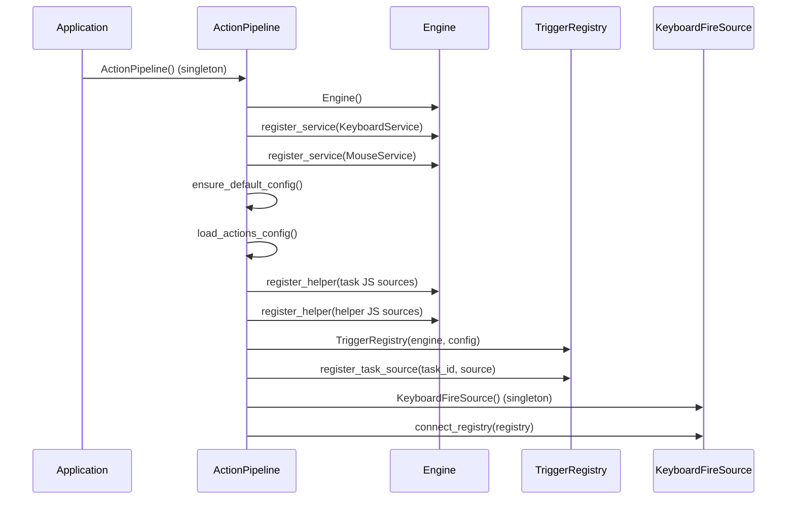

# Action Pipeline

**File**: `src/stagehand/action_pipeline.py`

The `ActionPipeline` singleton wires together the entire config-centric action system at app startup.

## Initialization Order

## Services Registered

| Service | JS name | Methods |
|---------|---------|---------|
| `KeyboardService` | `stagehand.keyboard`, `stagehand.kb` | `tap(key)`, `press(key)`, `release(key)`, `type(string)` |
| `MouseService` | `stagehand.mouse` | `click(button, times)`, `press(button)`, `release(button)`, `position(x,y)`, `move(dx,dy)`, `scroll(dir,steps)` |

## Fire Sources Connected

| Fire Source | Event Type | Example Event |
|-------------|------------|---------------|
| `KeyboardFireSource` | `keyboard` | `{'type': 'keyboard', 'key': 'ctrl+shift+l', 'event': 'press'}` |
| `StartupFireSource` | `startup` | `{'type': 'startup', 'delay': 2000}` |

## Hot Reload

- `reload_config()` — reload actions.yaml from disk
- `reload_tasks()` — reload config/tasks/*.js and re-register with registry
- `reload_helpers()` — reload config/helpers/*.js and re-inject into engine
- `reload_all()` — all of the above

## Related

- [config/config-module.md](config/config-module.md) — Config data models and I/O
- [config/trigger-registry.md](config/trigger-registry.md) — Fire event matching
- [architecture/new-config-format.md](architecture/new-config-format.md) — Architecture doc