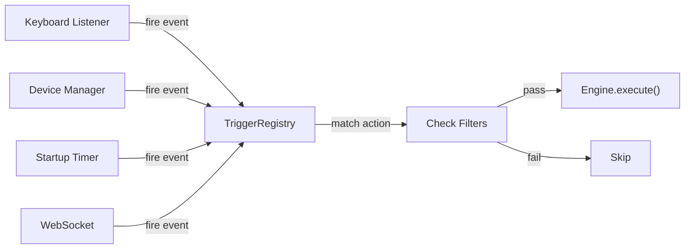

# Trigger Registry

**File**: `src/stagehand/trigger_registry.py`

The `TriggerRegistry` matches fire events to actions from the config and executes tasks through the Roadie engine.

## Architecture



## How It Works

1. **Trigger sources** call `registry.on_fire(event_dict)` with a distilled event
2. Registry iterates all actions in the config, checking:
   - Is the action `enabled`?
   - Does any trigger match the event? (OR logic — any match fires)
   - Do all filters pass? (AND logic — all must pass)
3. If matched, execute the task through the engine

## Fire Events

All trigger sources distill down to a typed dict:

```python
# Keyboard
{'type': 'keyboard', 'key': 'ctrl+shift+l'}

# Device pedal
{'type': 'device', 'name': 'stomp4', 'pedal': 1}

# Startup
{'type': 'startup', 'delay': 2000}

# WebSocket
{'type': 'web', 'action': 'click', 'button': 1}
```

## Filter Checkers

Register filter type handlers via `register_filter_checker()`:

```python
registry.register_filter_checker(
    'active_window',
    lambda params, event: event.get('window') == params
)
```

If no checker is registered for a filter type, it's skipped (permissive default).

## Task Execution

- **Named tasks** (e.g., `obs.switchScene`): looked up from registered task sources
- **Inline JS** (`stagehand.js`): body evaluated directly
- Task params are injected as `_params` JSON for named tasks

## Action Callbacks

Register callbacks via `on_action()` for UI feedback (highlighting, logging):

```python
registry.on_action(lambda action: print(f"Fired: {action.name}"))
```

## Related

- [config-module.md](config-module.md) — Data models and I/O
- [plans/config-format.md](../plans/config-format.md) — Design plan
- [sandbox/runtime.md](sandbox/runtime.md) — Roadie engine execution