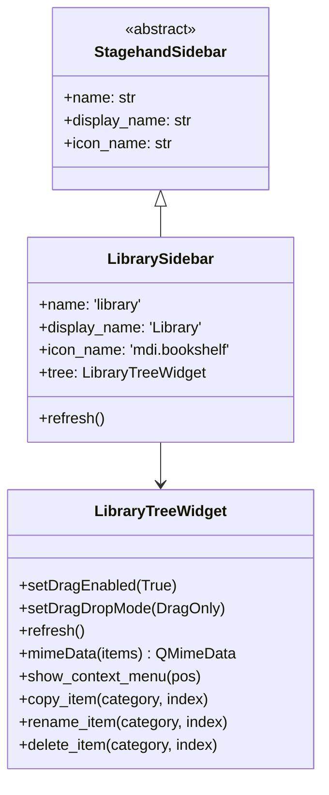

# Library System

## Overview

The Library provides a collection of reusable trigger, filter, output, and action definitions. Items are stored in JSON files and can be copied or dragged into action configurations. The library uses a copy-on-use model - when an item is copied or dropped, it becomes an independent instance.

## File Structure

```
# Built-in library (shipped with app, read-only)
src/stagehand/library/builtin_library.json

# User library (portable mode)
src/stagehand/.portable/user_library.json

# User library (standard mode)
~/.config/Stagehand/user_library.json
```

## Data Format

```json
{
  "version": 1,
  "triggers": [
    {"name": "Push-to-Talk Key", "trigger_type": "keyboard", "trigger": "Space", ...}
  ],
  "filters": [
    {"name": "OBS Window Focused", "type": "active window", "window": "OBS", ...}
  ],
  "outputs": [
    {"name": "Toggle OBS Mute", "type": "obs", "action": "toggle_mute", ...}
  ],
  "actions": [
    {"name": "Hello World on Startup", "trigger": {...}, "filter": {...}, "action": {...}, ...}
  ]
}
```

Each category uses the existing serialization format (`get_data()`/`set_data()`) with an added `name` field.

## Components

### Library Manager

**File**: `src/stagehand/library/manager.py`

Manages loading, saving, and accessing library items.

```python
from stagehand.library import get_library

library = get_library()

# Get all items merged (builtin + user)
items = library.get_all_items()

# Add new user item
library.add_item('triggers', {'name': 'My Trigger', ...})

# Delete user item
library.delete_item('triggers', index)

# Rename user item
library.rename_item('triggers', index, 'New Name')
```

### LibrarySidebar

**File**: `src/stagehand/library/sidebar.py`

Sidebar panel with tree view of library items. Supports context menu (Copy/Rename/Delete) and drag to ActionWidget.



## Drag & Drop

Library items can be dragged onto ActionWidgets to replace slot contents.

### Mime Type

```
library_drop
```

### Payload Format

```json
{
  "category": "triggers|filters|outputs|actions",
  "data": { ... item serialization ... }
}
```

### Drop Targets

| Category | Target Slot | Behavior |
|----------|------------|----------|
| Actions | Entire ActionWidget | Replace all (keep name) |
| Triggers | Trigger widget | Replace trigger data |
| Outputs | Action (output) widget | Replace output data |
| Filters | Not implemented | Deferred |

### Visual Feedback

When dragging over an ActionWidget:
- Blue border (`#0078D7`) highlights the target slot
- For Actions: entire ActionWidget gets border
- For Triggers: only the trigger area gets border
- For Outputs: only the action/output area gets border

## Context Menu Actions

| Action | Built-in Items | User Items |
|--------|----------------|------------|
| Copy | ✓ | ✓ |
| Rename | ✗ | ✓ |
| Delete | ✗ | ✓ |

## Copy/Paste Flow

```
1. User right-clicks library item → Copy
2. LibraryTreeWidget.copy_item() puts JSON on clipboard (plain text)
3. User right-clicks ActionWidget/Trigger/Filter/Output → Paste
4. Target deserializes via set_data()
```

## Save to Library

Context menu option on ActionWidget, ActionTrigger, ActionFilter, and Action:

1. Right-click → "Save [type] to Library"
2. Dialog opens with name input and JSON preview
3. On confirm: saved to `user_library.json`
4. Library sidebar refreshes automatically

## Built-in Starter Items

| Name | Type | Description |
|------|------|-------------|
| Push-to-Talk Key | Trigger | Keyboard trigger template (key unset) |
| OBS Window Focused | Filter | Active window filter for OBS |
| Toggle OBS Mute | Output | OBS mute toggle action |
| Hello World on Startup | Action | Startup trigger + sandbox print |
| Toggle OBS Mute on F1 | Action | Keyboard F1 trigger + OBS mute |

## Future Considerations (Out of Scope)

- Drag-and-drop from sidebar to empty page (create new ActionWidget)
- Drop support for CompactActionWidget
- Library import/export (sharing between users)
- Parameterized templates (slots for user input)
- Library search/filter
- Folders/sub-groups in library