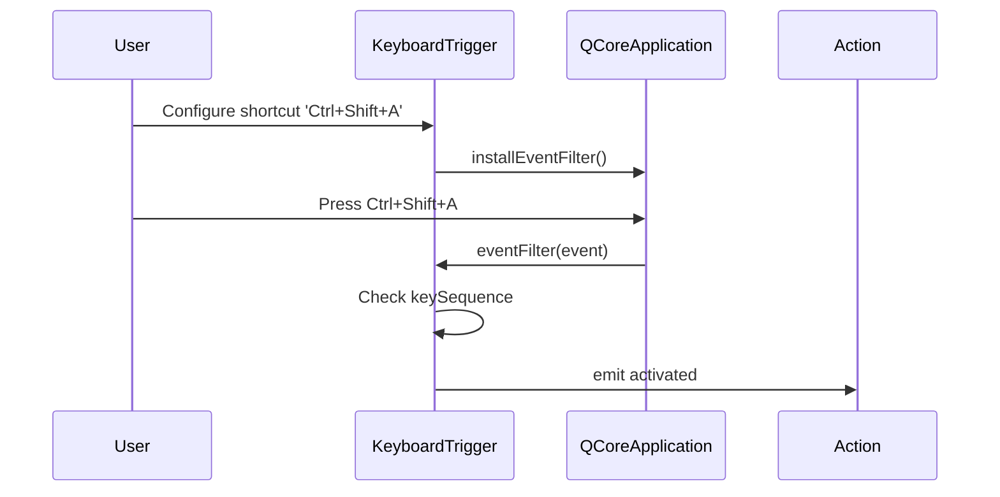

# Keyboard Plugin

**Location**: `src/stagehand/plugins/keyboard/`

## Components

### KeyboardTrigger

**File**: `keyboard_trigger.py`

Listens for keyboard shortcuts and activates action when pressed.



### KeyboardAction

**File**: `keyboard_action.py`

Simulates keyboard input.

```python
class KeyboardAction(ActionItem):
    name = 'keyboard'
    
    def run(self):
        # Send configured key sequence
        keyboard_extension.press(self.keys)
        keyboard_extension.release(self.keys)
```

### KeyboardExtension

**File**: `keyboard_extension.py`

Sandbox extension for programmatic keyboard control.

```python
class KeyboardExtension(SandboxExtension):
    name = 'keyboard'
    
    def press(self, key):
        """Press and hold a key."""
        
    def release(self, key):
        """Release a held key."""
        
    def type(self, text):
        """Type a string of characters."""
```

### MouseExtension

**File**: `keyboard_extension.py`

Sandbox extension for mouse control (grouped with keyboard plugin).

```python
class MouseExtension(SandboxExtension):
    name = 'mouse'
    
    def move(self, x, y):
        """Move cursor to screen position."""
        
    def click(self, button='left'):
        """Click mouse button."""
        
    def scroll(self, direction='down'):
        """Scroll mouse wheel."""
```

## Sandbox Usage

```python
# Keyboard input
keyboard.press('ctrl')
keyboard.press('c')
keyboard.release('c')
keyboard.release('ctrl')

# Typing
keyboard.type('Hello World!')

# Mouse control
mouse.move(500, 300)
mouse.click('left')
mouse.scroll('down')
```

## Key Format

Uses QKeySequence conventions:
- Single key: `'a'`, `'space'`, `'escape'`
- Modifiers: `'ctrl+a'`, `'shift+tab'`, `'alt+f4'`
- Special: `'f1'`, `'home'`, `'end'`, `'pageup'`, `'pagedown'`

## Implementation Notes

- Uses `pynput` for keyboard/mouse simulation
- Event filter on QCoreApplication for trigger detection
- Thread-safe: input simulation runs in separate thread