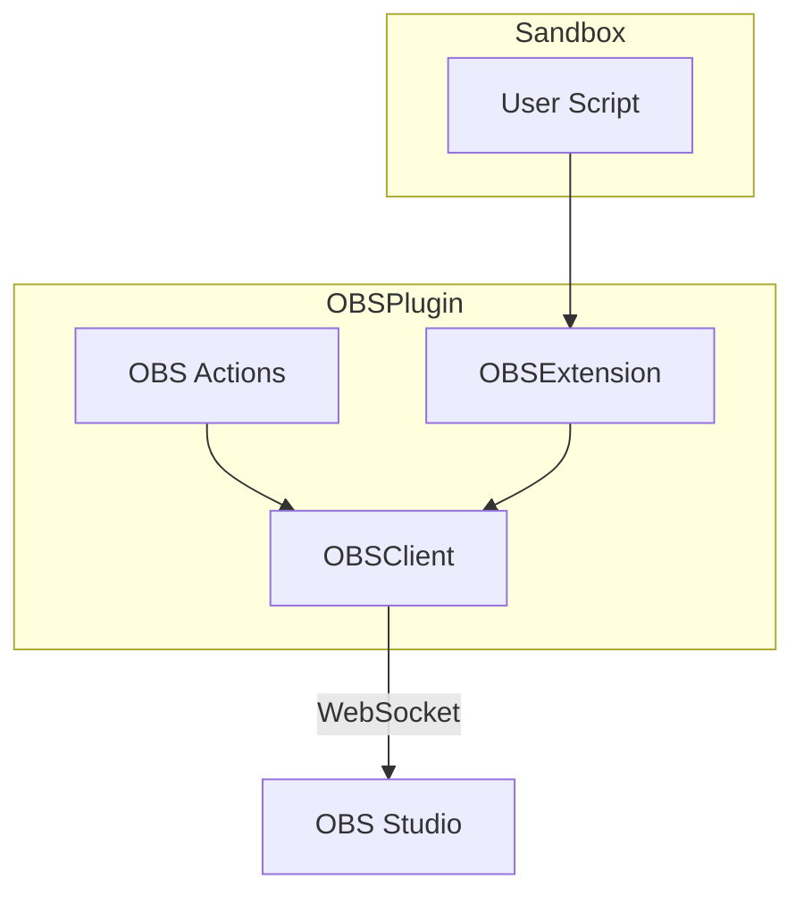

# OBS Core Plugin

**Location**: `src/stagehand/plugins/obs_core/`

**Purpose**: Control OBS Studio via obs-websocket.

## Setup

Requires OBS Studio with obs-websocket plugin installed:
- URL: `localhost:4444` (default)
- Password: optional

## Architecture



## Extension: OBSExtension

Provides OBS control in sandbox:

```python
class OBSExtension(SandboxExtension):
    name = 'obs'
    
    # Scene control
    def set_current_scene(self, name): ...
    def get_current_scene(self): ...
    
    # Source visibility
    def set_source_visibility(self, source, visible): ...
    def get_source_visibility(self, source): ...
    
    # Streaming
    def start_streaming(self): ...
    def stop_streaming(self): ...
    def is_streaming(self): ...
    
    # Recording
    def start_recording(self): ...
    def stop_recording(self): ...
    
    # Text sources
    def set_text(self, source, text): ...
    
    # Settings
    def set_source_settings(self, source, settings): ...
```

## Sandbox Usage

```python
# Scene switching
obs.set_current_scene('Game')

# Toggle source
if obs.get_source_visibility('Webcam'):
    obs.set_source_visibility('Webcam', False)
else:
    obs.set_source_visibility('Webcam', True)

# Stream control
if not obs.is_streaming():
    obs.start_streaming()

# Update text source
obs.set_text('Title', 'Now Playing: Minecraft')

# Filter control
obs.set_source_settings('Camera', {
    'filter': 'blur',
    'amount': 10
})
```

## Actions

Multiple action types for common OBS operations:

- **SetSceneAction**: Switch to specified scene
- **ToggleSourceAction**: Toggle source visibility
- **SetTextAction**: Update text source content
- **StreamToggleAction**: Start/stop streaming
- **RecordToggleAction**: Start/stop recording

## Event Subscription

The OBS client can subscribe to events:
- Scene changed
- Stream started/stopped
- Recording started/stopped
- Source activated/deactivated

## Generated Code

**File**: `plugins/obs_core/gen.py`

Automatically generates action types from OBS API:
```bash
make obs  # Regenerate actions from obs-websocket API
```

## Troubleshooting

| Issue | Solution |
|-------|----------|
| Connection refused | Check OBS running and websocket enabled |
| Auth failed | Verify password in OBS settings |
| Source not found | Check exact source name in OBS |
| Scene not found | Check scene names are case-sensitive |