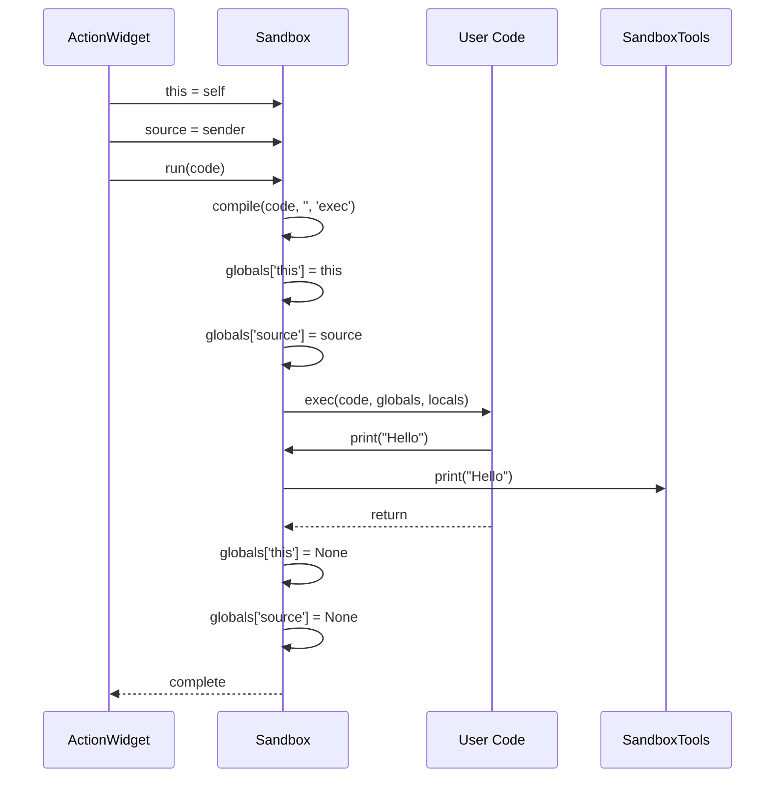

# Sandbox Runtime

## Execution Environment

The Sandbox provides a Python execution context with:
- Restricted globals (no `__import__`, `open`, etc.)
- Injected extensions from plugins
- Persistence via `save()`/`load()` and `data` dict
- Context objects `this` and `source`

## Available Names

```python
# Built-in
save(name, value)    # Persist value
load(name) -> any    # Retrieve value
data: dict           # Direct access to storage
print(...)           # Redirected to tools panel

# Context (set during ActionWidget.run())
this: ActionWidget   # Action instance
source: object       # Event source

# Extensions (from plugins)
keyboard.press(key)
keyboard.release(key)
mouse.move(x, y)
obs.set_source_settings(...)
# etc.
```

## Execution Flow



## Error Handling

```python
def run(self, text, error_cb=None):
    if text == '':
        return
    
    error = ''
    try:
        code = compile(text, '', 'exec')
        self._globals['this'] = self.this
        self._globals['source'] = self.source
        exec(code, self._globals, self._locals)
    except Exception as e:
        error = str(e)
    
    self._globals['this'] = None
    self._globals['source'] = None
    
    if error_cb:
        error_cb(error)
    else:
        self.tools.print(error)
```

## Compile Check

Actions can pre-validate code before execution:

```python
Sandbox().compile(text, error_cb=callback)
```

Used in action editors to show syntax errors before run.

## Persistence Behavior

Data persists across action executions within a session:

```python
# In action 1:
save('counter', 0)

# In action 2:
counter = load('counter')  # Returns 0
save('counter', counter + 1)

# In action 3:
print(load('counter'))  # Prints: 1

# Or directly:
data['my_value'] = 42
```

**Note**: Data cleared on application restart (in-memory only).

## SandboxExtension Pattern

```python
class SandboxExtension:
    """Base class for sandbox extensions."""
    name: str  # Must be defined in subclass
    
class MyExtension(SandboxExtension):
    name = 'my_ext'
    
    def greet(self, name):
        return f'Hello, {name}!'
    
    @property
    def status(self):
        return 'active'

# Usage in sandbox:
# my_ext.greet('World')  # Returns: 'Hello, World!'
# my_ext.status  # Returns: 'active'
```

## Security Considerations

**Not sandboxed in security sense** - users have full Python access via `exec()`. The "sandbox" name refers to:
- Namespaced execution context
- Isolated from main application logic
- Protected from accidental variable pollution

**Actual security**: None. Users can import modules, access system, etc. This is a **feature**: power users can write complex automation scripts.