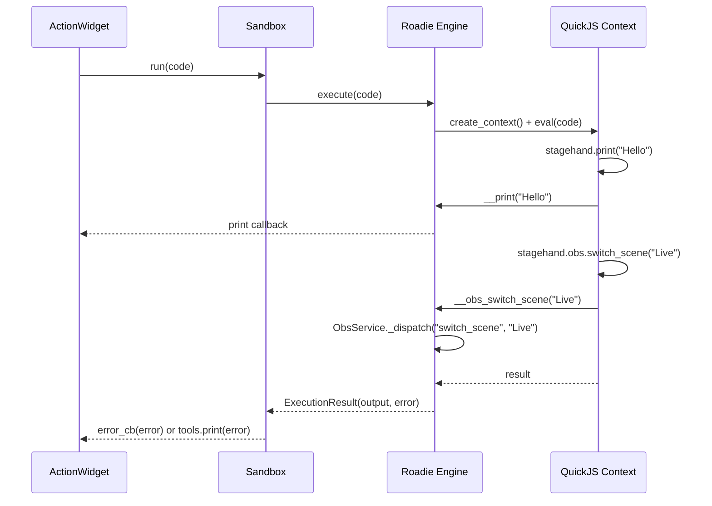

# Sandbox Runtime

## Execution Environment

The Sandbox now delegates to the Roadie QuickJS engine for code execution. Actions are written in JavaScript and evaluated in isolated QuickJS contexts. Only explicitly injected callables are available to user code — the boundary is structural, not conventional.

## Execution Flow



**Key change**: `this` and `source` are no longer injected into the sandbox namespace. They violated the narrow waist — if action code needs context, it flows through the `fire` event payload, not UI object references.

## Available Names (in JS contexts)

```javascript
// Built-in
stagehand.save(name, value)    // Persist value
stagehand.load(name)            // Retrieve value
stagehand.print(...)            // Output to tools panel

// Services (from SandboxExtension subclasses, via adapter)
stagehand.keyboard.tap("a")
stagehand.obs.switch_scene("Live")
stagehand.http.get("https://example.com")
stagehand.kb.press("ctrl")      // alias for keyboard
// etc.
```

## Sandbox Delegation

The `Sandbox` class now delegates to the Roadie engine:

| Sandbox method | Engine method | Behavior |
|---|---|---|
| `Sandbox().run(code)` | `engine.execute(code)` | Fire-and-forget, fresh context each call |
| `Sandbox().eval(code)` | `engine.evaluate(code)` | Return value, fresh context |
| `Sandbox().compile(code)` | `engine.validate(code)` | Syntax check only, no execution |

Error handling maps: `ExecutionResult.error` → `error_cb(error)`, `ValidationResult.error` → `error_cb(error)`.

## ExtensionSystem — Dual Path

During migration, `SandboxExtension` subclasses work through `ExtensionToServiceAdapter`:

```python
# sandbox.py __init__:
for ext in SandboxExtension.__subclasses__():
    e = ext()
    self.extensions[name] = e
    self._engine.register_service(ExtensionToServiceAdapter(e))
```

Later, each extension will switch from `SandboxExtension` to `Service` directly (one-line parent class change), and the adapter will be removed.

## Auto-Unwrap

Service methods returning dicts/lists are auto-serialized at the FFI boundary and auto-unwrapped in JS:

```javascript
var scenes = stagehand.obs.list_scenes()  // Returns native JS object, not JSON string
scenes.scenes[0]  // "Live"
```

## Persistence Behavior

Data persists across action executions within a session via `stagehand.save()`/`stagehand.load()`. Each `execute()` call creates a fresh context, but the persistence store is shared across the Engine instance.

## Security

The QuickJS context is structurally isolated — no `require`, no `import`, no filesystem access. Only explicitly injected `__service_method` FFI callables are available. This is a genuine trust boundary, unlike the old Python `exec()` sandbox which had no real isolation.

**Trust model**: Plugins (Python `SandboxExtension` / `Service` subclasses) are trusted code. Action eval code (JS in QuickJS) is untrusted. The stagehand Proxy is the narrow waist between them.